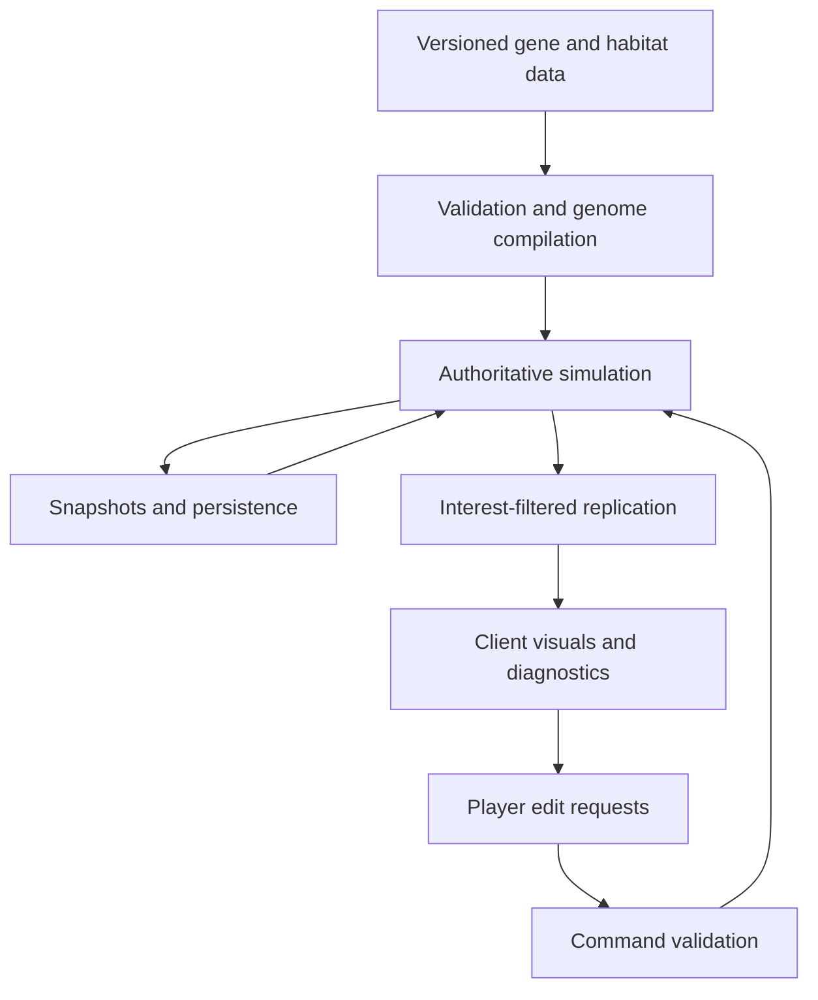

# Prokaryon — Game Specification and Development Checklist

**Version:** 0.1 — design discovery specification  
**Prepared:** September 29, 2026  
**Project owner:** Pierce Jamieson  
**Intended outcome:** A solo-developed game released on Steam, with a long-term vision of a vast multiplayer microbial ecosystem.

## How to use this document

This is a specification for discovering, building, validating, and shipping Prokaryon. It preserves the supplied vision while identifying decisions that have not been made. It is not an assertion that a particular engine, visual style, business model, player count, or persistence model has been selected.

- **CONFIRMED:** Explicitly requested in the brief.
- **OPEN:** Requires a decision by the project owner. Alternatives are compared below.
- **PROPOSED:** A development approach, prototype scope, or acceptance criterion to evaluate; not an approved product decision.
- **EVIDENCE:** Biological or platform information grounded in the source register.
- **GATE:** Evidence required before expanding scope. If a gate fails, revise the system or revisit scope before proceeding.

All numerical budgets and playtest thresholds below are **illustrative starting hypotheses**, unless explicitly identified as platform requirements. Replace them with measured targets on named hardware. Checkboxes are intentionally unchecked: a written plan is not completed development work.

**Recommended reading order:** Sections 1–3 for the product contract; 4–10 for system design and unresolved decisions; 11–13 for implementation and scale; 14–18 for development and release; 19–22 for risks, questions, working templates, and sources.

**Jump to:** [Vision](#1-product-vision-and-scope-contract) · [Biology](#2-biological-fidelity-contract) · [Gene designer](#5-gene-designer-and-regulatory-model) · [Multiplayer](#9-multiplayer-product-and-persistence) · [Art](#10-visual-direction-interface-audio-and-accessibility) · [Architecture](#11-software-architecture-and-engine-selection) · [Roadmap](#14-staged-development-roadmap) · [First backlog](#15-first-executable-backlog) · [Steam](#18-steam-and-launch-checklist) · [Questions](#20-questions-for-the-project-owner)

---

## 1. Product vision and scope contract

### 1.1 Core proposition

**Design a microbial lineage by engineering its genes and regulation, then watch its cells survive, reproduce, compete, and cooperate in a living environment.** The player's agency comes from changing inherited behavior and physiology. Individual cells are expendable; continuation depends on the survival of the player's population.

The core loop is:

1. Observe the environment and diagnose a limitation.
2. Choose a genetic intervention and its regulation.
3. Commit the edit under the chosen inheritance rules.
4. Observe expression, behavior, metabolism, and ecological consequences.
5. Sustain growth and division to earn mutation points.
6. Reinvest in adaptation, diversification, or interaction with other species.
7. Continue through surviving cells until the relevant population becomes extinct.

The most important prototype question is whether this loop is satisfying **before** a large gene catalog, expansive world, or large multiplayer population exists.

### 1.2 Confirmed requirements

| ID | Requirement from the brief | Evidence needed in the game |
|---|---|---|
| V01 | Play as a cell, beginning with a small population | A focal cell and an understandable relationship to the wider lineage |
| V02 | No direct steering through WASD or destination clicks | Cell movement results from physiology, behavior, environment, and interactions |
| V03 | Control is exerted through genes | Meaningful edits produce observable changes with costs and constraints |
| V04 | Choose genes and promoters | Expression strength and conditional expression affect phenotype |
| V05 | Control spatial expression/placement, including orientation relative to light | A spatial targeting mechanic; biological representation remains open |
| V06 | Cell death transfers play to a survivor | Continuation does not depend on one privileged cell |
| V07 | Population extinction ends the current continuation | The relevant population boundary and post-extinction progression remain open |
| V08 | Division earns mutation points | Reproduction events reliably award the defined currency |
| V09 | Temperature, light, pH, salinity, currents, and microniches matter | Each supported environmental factor creates observable strategic consequences |
| V10 | Other species can help, exploit, or attack one another | Mechanistic interactions, rather than only relationship labels |
| V11 | Players own and name species | Stable ownership and lineage identity, including after genetic exchange |
| V12 | Genes can transfer between players | A horizontal gene-transfer mechanic with explicit inheritance rules |
| V13 | Evolution-inspired progression exposes available genes | A navigable progression graph with intelligible biological relationships |
| V14 | Movement is confined to an XY plane | No gameplay advantage from moving along the visual depth axis |
| V15 | Beautiful 2D or 2.5D presentation with background depth | Cohesive art, readable foreground, useful depth cues |
| V16 | Efficient simulation and a large multiplayer ambition | Measured capacity, viable hosting costs, and a credible growth path |
| V17 | Solo development leading to Steam release | Sustainable production, distribution, support, and maintenance plans |

### 1.3 Product principles to validate

**PROPOSED:** Use these as review questions rather than additional locked features.

- Can a player explain why a cell is doing something?
- Does each major adaptation solve a problem while creating a cost or vulnerability?
- Can a smaller specialist succeed where a larger generalist struggles?
- Can interesting ecology emerge from a manageable number of interacting rules?
- Is watching enjoyable, and is intervening consequential?
- Does the world remain interesting with few humans online?
- Can a single developer diagnose, rebalance, and operate what has been built?

### 1.4 Separate the destination from the first product

A vast multiplayer ecology, potentially persistent, combines a simulation game, a genetic programming interface, and an online service. Each is a substantial project. The roadmap should test their hardest assumptions early without requiring all three to reach final scale simultaneously.

**OPEN — release contract:** Must Steam 1.0 include the vast shared world, or can an explicitly bounded multiplayer version be a complete first release? A local prototype is a development tool and does not settle whether the commercial game offers offline play.

| Candidate release boundary | Advantages | Disadvantages and obligations |
|---|---|---|
| Bounded multiplayer habitats, potentially with local play | Clear capacity limits; manageable recovery and testing; a complete small ecosystem can establish the loop | May not satisfy the intended feeling of one immense living world |
| Multiple persistent habitat servers | Persistent relationships and population histories; incremental capacity growth | Each server needs sufficient activity; migration, wipes, moderation, and operations become product systems |
| One logically continuous world, partitioned internally | Closest to the full vision; large-scale ecological geography | Expensive cross-boundary authority, congestion, persistence, and recovery problems; highest solo-project risk |

No boundary is selected here. Do not advertise the third while shipping only the first without clearly describing the difference.

---

## 2. Biological fidelity contract

### 2.1 Correct the mapping without losing the mechanic

| Proposed concept | Biological distinction | Design alternatives |
|---|---|---|
| A promoter determines expression strength and conditions | Promoter activity depends on regulatory context, including transcription factors and signals; the promoter is not an autonomous environmental computer | Bundle a promoter with its sensor/regulator as an accessible module, or expose those components separately |
| A promoter places a flagellum on a particular side | Spatial targeting generally needs localization, polarity, trafficking, or assembly machinery beyond the promoter itself | Keep a combined **regulatory cassette** UI, or separate expression control from localization/assembly control |
| Flagellum appears opposite the light | Sensing a scalar light intensity does not automatically supply a directional vector; installation, turnover, and body rotation also matter | Allow abstract directional sensing and label it, or require an explicit sensing/polarity module |
| Sexual transfer through a type III secretion system | Bacterial conjugation commonly uses type IV secretion machinery; T3SS injectisomes deliver proteins | Use conjugation for contact-mediated DNA transfer, with optional transformation or transduction as separate systems |
| ATP synthase becomes a flagellar motor | Homology concerns components such as export ATPases; a direct whole-ATP-synthase-to-torque-motor lineage is not established | Show shared machinery, energetic dependencies, and co-option separately from ancestor–descendant claims |
| Flagellin becomes secretion systems | Flagellin is a filament protein; relationships between flagellar export systems and injectisomes concern multi-component machinery | Unlock related modules through shared components, with an evidence label on evolutionary relationships |
| Light-sensitive proteins become photosynthetic proteins | Microbial rhodopsin phototrophy and chlorophyll-based reaction centers should not be presented as one settled linear lineage | Separate sensory, rhodopsin energy-capture, reaction-center, pigment, and carbon-fixation branches |

Spatial assembly and directional sensing are illustrated by [B1] and [B2]; conjugation by [B3]; ATPase and propulsion distinctions by [B4] and [B5]; flagellar/T3SS phylogeny by [B6]; rhodopsin phototrophy by [B7]. These sources support the distinctions, not a finalized progression order. They preserve the intended gameplay while avoiding inaccurate labels.

### 2.2 Choose the unit of biological abstraction

**OPEN B01 — what is a selectable “gene”?**

| Option | Advantages | Disadvantages |
|---|---|---|
| One entry per actual gene/product | Fine mechanistic control; strong educational specificity | Large prerequisite burden; many individually uninteresting components; more UI and balance work |
| Functional modules representing several genes | A transporter, sensor circuit, or flagellar system can be a meaningful decision | Less literal genetics; requires honest labeling |
| Modules initially, expandable into subcomponents | Accessible entry with eventual depth | Two representations to maintain; expansion can overwhelm scope |

A functional module can still display representative genes and molecular context in an inspect panel. Actual nucleotide-sequence design is not required by the brief.

**OPEN B02 — biological scope:** bacteria only, bacteria plus archaea, or stylized prokaryotes? Bacterial and archaeal envelopes and motility machinery are not interchangeable. A later eukaryotic transition would introduce substantially different mechanics and is a separate scope decision.

**OPEN B03 — fidelity priority:** quantitative realism, mechanistic plausibility, or readable evolutionary metaphor? Record where each subsystem falls. Quantitatively calibrated physiology would require substantial parameterization and validation beyond using biologically correct names.

### 2.3 Fidelity ledger

Maintain one entry per abstraction:

| Field | Purpose |
|---|---|
| Biological claim and scope | What real mechanism or relationship is being represented |
| Game representation | What state and rules the player actually encounters |
| Deliberate simplification | What is omitted or accelerated |
| Consequence | Where the simplification changes likely behavior |
| Source and confidence | Established mechanism, supported inference, disputed interpretation, or invented mechanic |
| UI wording | Prevent an abstraction from being taught as a literal fact |

Examples to document: compressed generation time; discrete environmental fields; simplified osmotic stress; abstract mutation currency; instantaneous genome editing; a combined regulatory/localization cassette; a cell constrained to a plane.

### 2.4 Physical consistency targets

**PROPOSED:** Favor internally consistent constraints over molecular detail.

- Cell-scale movement should resemble overdamped motion: propulsion and flow matter more than ballistic momentum. If inertial motion is used for feel, label it as stylization.
- Diffusion, uptake, secretion, decay, and advection should have compatible units and explicit sources/sinks.
- pH is logarithmic. Do not mix or average pH values as though they were concentrations in a chemistry model. A buffered acidity/stress proxy is an alternative if labeled.
- Phototrophic ATP generation does not by itself supply carbon biomass; distinguish energy capture from carbon fixation or organic-carbon uptake. Carbon fixation also requires reducing equivalents/electron supply. Combining ATP and ion motive force in one energy pool would be a declared simplification.
- Oxygenic and anoxygenic phototrophy need not have identical costs or outputs.
- More protein expression consumes capacity and resources; condition-dependent expression should have a reason to beat constitutive overexpression.
- Local geometry should alter transport, exposure, or retention if caves are to be meaningful.

---

## 3. Player agency, ownership, time, and failure

### 3.1 Decisions to settle before building the full editor

| ID | OPEN decision | Options and advantages/disadvantages | Needed by |
|---|---|---|---|
| D01 | What does the player identify with? | **Focal cell:** intimacy, but weak population awareness. **Lineage overview:** strategic clarity, less embodiment. **Switchable views:** supports both, more interface work. | Stage 1 |
| D02 | Which cells receive an edit? | **Focal cell only:** intimate and selective, can encourage repetitive editing. **Its descendants:** inheritance matters, feedback is slower. **All owned cells:** clear and accessible, biologically abstract and potentially dominant. **Selected sublineage:** experimentation, more bookkeeping. | Stage 1 |
| D03 | When does an edit apply? | **Immediately:** fast feedback, possible emergency steering. **At division:** fits inheritance and currency loop, can make recovery impossible when starving. **Queued after a delay:** tunable pacing, requires a clear forecast. | Stage 1 |
| D04 | How often should intervention matter? | **Frequent tuning:** active play, high cognitive load. **Occasional redesign:** contemplative, may feel idle. **Long experiments with episodic crises:** strong stories, pacing is harder. | Stage 1 |
| D05 | What remains after extinction? | **Nothing in the run:** stakes, repetition risk. **Blueprints/knowledge:** learning persists, weaker loss. **Permanent unlocks:** progression, veteran advantage and grind risk. | Stage 2 |
| D06 | What is the extinction boundary? | **All owned cells in one habitat:** easy to explain. **Across linked regions:** matches dispersal, harder tracking. **Across the whole service:** severe stakes and difficult offline accounting. Decide whether dormant cells count. | Stage 2 |
| D07 | Does editing pause time? | **Local pause:** thoughtful, easy offline. **Live world:** consistent multiplayer, editing can be stressful. **Protected editor/lab:** accessible, requires anti-abuse rules and return behavior. | Stage 1 |
| D08 | What can the player know? | **Full overlays:** legible but near-omniscient. **Sensor-limited information:** meaningful sensing genes, harder diagnosis. **Basic diagnostics plus optional sensing:** compromise with more disclosure rules. | Stage 2 |
| D09 | How is the next focal cell chosen? | **Automatic nearest/healthy survivor:** quick continuation, may surprise. **Manual list/map:** deliberate, slower. **Automatic with override:** more control, extra UI. | Stage 2 |
| D10 | Can lineages diverge simultaneously? | **One active genome:** simple identity, limited experimentation. **Several strains:** niche specialization, more UI and balance load. **Emergent mutations:** evolutionary flavor, unpredictable maintenance. | Stage 2 |

### 3.2 Keep the no-steering promise testable

Allowed interface actions can include observing, inspecting, selecting a focal cell, naming, comparing genomes, and committing edits. Those actions should not secretly apply forces, teleport cells, select destinations, or modify survival.

**OPEN:** Are cells autonomous controllers with genetically specified taxis, environmental thresholds, memory, and motor responses? If so, define the permitted regulatory language and its complexity cost. A repeated instantaneous “move the flagellum to this side” edit could function as manual steering in disguise. Costs, assembly delays, body-relative placement, and edit cadence are options to test; none is chosen here.

Camera movement must not move cells or reveal hidden information that the selected information model forbids. Watching a cell should not improve its simulation fidelity in a way that changes its competitive success.

### 3.3 Interaction timing to measure

Record, rather than guess:

- Time to understand the initial threat.
- Time to the first affordable intervention.
- Time between an edit and its first visible expression change.
- Time between expression change and a measurable fitness consequence.
- Time without a meaningful decision or interesting event.
- Fraction of a session spent in the editor, world view, and diagnostic views.
- Whether players can recover from a poor edit without restarting immediately.

**PROPOSED first test:** In a 15–20 minute session, a new player should perform several coherent observe–edit–evaluate cycles and correctly explain at least one success and one failure. Establish the desired pace through testing, not a hidden commitment to idle-game or real-time-strategy pacing.

### 3.4 Starting state and the first intervention

**OPEN D42 — starter genome:**

| Option | Advantages | Disadvantages |
|---|---|---|
| One fixed starter | Controlled onboarding and comparable balance tests | Repetitive openings; limited early identity |
| Several curated starter archetypes | Early identity and distinct ecological approaches | More tutorials/balance cases; poor choices can be punished before learning |
| Bounded custom starter | Immediate genetic ownership and experimentation | Beginner traps and optimization exploits; more validation and explanation |

**OPEN D43 — initial opportunity:** Starting with no mutation points makes the first division meaningful but requires the baseline genotype and spawn to survive long enough to earn it. A small initial allocation permits an immediate genetic choice but changes progression pacing. Either can preserve division as the continuing source of mutation points.

Specify starting population size, energy/biomass reserves, unlocked modules, initial currency, and safe learning conditions. Compare random spawning (variety but possible unwinnable starts) with automatically validated viable spawning (fairer but more generation constraints). Optional pre-run habitat selection offers strategic agency but must be explicitly reconciled with the intended genes-only control boundary. It must not become in-run teleportation or manual cell placement by accident.

- [ ] A baseline cell can reach a first division or meaningful edit under the intended tutorial conditions.
- [ ] A bad spawn cannot silently make the first run unwinnable before any useful decision.
- [ ] Restart and re-entry cannot be exploited to reroll resources or evade costs without consequence.

---

## 4. Cell physiology, behavior, growth, and death

### 4.1 Candidate state model

This is a starting engineering model, not a decision to simulate every item.

| State group | Candidate state | Why it may matter | Cost-control option |
|---|---|---|---|
| Identity | Cell ID, owner, species, strain, parent IDs, genome version | Ownership, inheritance, transfer, replay | Shared immutable genome definitions |
| Geometry | XY position, orientation, size, shape class | Collision, transport, spatial phenotype | Circle/capsule proxies; visual geometry separate |
| Economy | Usable energy, biomass, nutrient pools | Growth, upkeep, starvation | Few limiting resource pools rather than all metabolites |
| Physiology | Damage, stress, internal homeostasis proxies | Environmental tolerance and death | Aggregate rates with explicit causes |
| Regulation | Sensor state, expression levels, regulatory memory | Conditional behavior and adaptation | Bounded program and cached structure |
| Apparatus | Motility, transporters, defenses, targeting | Connect genes to visible function | Module counts/occupancy rather than individual proteins |
| Lifecycle | Age, division readiness, dormancy, death state | Reproduction and extinction | Scheduled events where appropriate |
| Ecology | Adhesion, local signals, transfer exposure | Social and antagonistic interactions | Local spatial queries with bounded work |

“Fed and happy” should resolve into understandable physiological constraints. **OPEN:** expose separate limiting resources, an aggregate condition score, or both. A single opaque happiness meter would make genetic diagnosis difficult.

### 4.2 Resource accounting

**PROPOSED conceptual balances:**

```text
energy change = harvested energy - maintenance - expression - motility - repair - other work
biomass change = assimilated matter - maintenance losses - exported matter
protein concentration change = synthesis per volume - degradation - dilution by growth
```

Implementation must handle resource limitation jointly: a cell cannot spend the same energy pool on several systems independently. Choose an allocation policy: proportional scaling, explicit priorities, or a small optimization model. Proportional scaling is cheap but may shut down critical maintenance; priorities are legible but can create threshold exploits; optimization is expressive but harder to predict and benchmark.

For density-based protein state, growth dilution differs from splitting molecule counts at division. Pick one representation and specify the conversion. Avoid accidental duplication of proteins, biomass, stored nutrients, or mutation points during division, save/load, or retry.

### 4.3 Motility and autonomous behavior

**OPEN alternatives:** biased run-and-tumble; continuous heading control from sensors; discrete behavioral states; simple evolved logic circuits. These differ in authenticity, learnability, visual clarity, and computational cost.

Define sensor noise, sampling interval, adaptation/memory, detection range, saturation, motor response, thrust/rotation, energy cost, and failure conditions. A freely supplied perfect gradient can make sensing genes cosmetic. Temporal comparison of scalar measurements is a cheaper alternative to an explicit spatial sensor array, but it produces different navigation behavior.

Flagellar location and propulsion direction need a specified mechanical relationship. More appendages should not automatically mean proportionally more speed. Attachment, drag, crowding, and diminishing performance are candidate balancing mechanisms.

### 4.4 Growth, division, mortality, and dormancy

- [ ] Specify division prerequisites: biomass, energy, limiting nutrients, size, and any timing constraint.
- [ ] Define how daughter cells inherit genome versions, expression, damage, stored resources, and polarity.
- [ ] Define daughter placement and collision resolution in a crowded niche.
- [ ] Define the event that grants mutation points and make its processing idempotent.
- [ ] Define death causes and report their causal history, not merely a final damage value.
- [ ] Define corpse/lysis outputs and resource recycling without net matter creation.
- [ ] Decide whether dormancy/sporulation is supported and how it affects extinction and offline persistence.
- [ ] Decide whether stochastic mutation exists in addition to purchased edits.
- [ ] Decide whether cell size and shape are evolvable and what limits their benefits.
- [ ] Verify that changing the focal cell has no physiological effect unless explicitly designed.

---

## 5. Gene designer and regulatory model

### 5.1 Required user workflow

1. Inspect the current genotype, expressed phenotype, and limiting conditions.
2. Select a gene/module from accessible progression content.
3. Select or configure expression strength and activation conditions.
4. Configure spatial targeting under the chosen abstraction.
5. See dependencies, incompatibilities, resource costs, and expected delays.
6. Compare the proposed genome with the current one.
7. See exactly which cells/descendants will receive the edit and when.
8. Review any applicable charge, commit under the chosen spending rules, or cancel an uncommitted draft.
9. Observe the resulting expression and phenotype in the world.
10. Save a blueprint or compare with a previous version if that feature is selected.

### 5.2 Regulatory language decision

| Option | Advantages | Disadvantages |
|---|---|---|
| Curated promoter cards: constitutive, low nutrient, high light, stress, density | Fast to learn; easy to validate and bound | Fewer combinations; conditions can feel arbitrary |
| Parameterized promoters with thresholds, gain, hysteresis | Expressive with a compact UI; good optimization depth | Tuning burden; unstable switching without sensible controls |
| Logic network with sensors, regulators, AND/OR/NOT, memory | Strong emergent programming possibilities | Harder onboarding, debugging, execution limits, and multiplayer validation |
| Sequence-level promoter construction | Deep biological identity if carefully modeled | Huge research and interface burden; sequence-to-function prediction would not be biologically reliable without a very restricted synthetic model |

**OPEN D11:** Choose the starting language and whether more complex forms are part of progression. Do not implement arbitrary player scripts on the server as a shortcut to gene complexity.

### 5.3 Spatial targeting decision

| Option | Advantages | Disadvantages |
|---|---|---|
| Discrete slots: pole, opposite pole, lateral ring, distributed | Legible; cheap; stable inheritance | Coarse geometry; supports only selected body plans |
| Continuous membrane coordinates | Fine customization; strong morphology identity | Harder validation, rendering, assembly, and orientation semantics |
| Sensor-linked polarity/assembly rules | Closest to the desired light-relative behavior | Requires sensing, memory, response time, turnover, and an understandable reference frame |

Spatial granularity (slots versus continuous coordinates) and targeting logic (fixed versus sensor-linked) are independent, combinable choices.

**OPEN D12:** Determine whether placements are fixed at construction, inherited as polarity, or continuously remodeled. Define what happens as the cell rotates, divides, grows, loses the light signal, or encounters two conflicting signals.

### 5.4 Expression dynamics

A lightweight model could use a saturating production function driven by a regulatory signal, a degradation rate, and dilution from growth. This is a gameplay approximation; exact functions and parameters remain open.

```text
regulatory target = bounded function(sensor state, promoter parameters, regulators)
actual synthesis = target synthesis constrained by available resources and expression capacity
phenotype strength = function(protein abundance, assembly state, localization, environment)
```

Expression capacity creates an allocation problem: investing in transport, motility, defense, repair, or transfer should displace something else. Regulatory machinery can have an upkeep cost; hysteresis or adaptation can prevent flicker around thresholds. Model response delay separately from the UI's refresh rate.

### 5.5 Editor specification checklist

- [ ] Gene/module catalog with stable IDs, descriptions, prerequisites, costs, and scientific notes.
- [ ] Clear distinction between installed DNA, expressed protein, and assembled functional machinery.
- [ ] Promoter response preview across environmental conditions.
- [ ] Localization preview with a visible reference frame.
- [ ] Resource and protein-allocation summary.
- [ ] Dependency/incompatibility validation before purchase.
- [ ] Pending-edit and inheritance preview.
- [ ] Undo/cancel for uncommitted edits; explicit rules for refund/respec after commitment.
- [ ] Version comparison and reliable recovery from invalid builds.
- [ ] Server-side validation of every committed edit.
- [ ] Readable basic mode with optional detail, if both are selected.
- [ ] Keyboard navigation, scalable text, non-color-only status encoding.
- [ ] An explanation of why a gene is inactive or a structure has not appeared.
- [ ] A test environment or forecast clearly labeled as approximate if offered.

---

## 6. Mutation economy and evolutionary progression

### 6.1 Division rewards are a central balance risk

A simple rule in which every division earns points creates a positive feedback loop: more cells create more divisions, which buy more advantages, which create more cells. It can also reward repeated births and deaths, tiny fast-dividing cells, safe farming habitats, alternate-account feeding, or high turnover without ecological success.

**CONFIRMED:** Division earns mutation points. **OPEN:** the amount, scaling, ownership, persistence, spending, and anti-farming constraints.

| Reward formulation | Advantage | Disadvantage |
|---|---|---|
| Fixed points per division | Direct, intuitive, easy to audit | Strong compounding and selection for division speed |
| Diminishing per-division reward as population or recent rewards grow | Limits runaway accumulation | Can feel like punishment for success; needs transparent accounting |
| Division reward weighted by physiological/ecological conditions | Rewards meaningful success | Complexity and manipulation opportunities; players may not understand payout |
| Fixed reward with escalating research costs or spending limits | Preserves simple birth feedback | Can create grind or merely delay domination |

A pure net-population-growth reward would change the stated premise; treat it as an explicit alternative only if the owner wants to revisit the rule.

### 6.2 Separate three kinds of cost

1. **Discovery/unlock cost:** Access to a possible adaptation.
2. **Editing/installation cost:** Committing a changed genome.
3. **Physiological cost:** Maintaining and expressing that adaptation in living cells.

**OPEN D13:** Which costs use mutation points, and which use cellular resources? Buying a gene once should not accidentally make its expression free forever. Conversely, charging at every layer can make experimentation punitive.

**OPEN D14:** Are points owned by a cell, strain, species, habitat run, or account? This choice affects transfer, extinction, disconnected play, and multiplayer fairness.

**OPEN D15:** Can players refund, respec, duplicate blueprints, or recover an earlier genome? Free respec supports exploration but can enable instantaneous counter-builds; irreversible purchases create stakes but may trap a beginner.

### 6.3 Progression should be a graph with typed relationships

Do not treat every line as “A evolved directly into B.” Candidate edge types:

- **Functional prerequisite:** A is needed for B to operate.
- **Shared component:** A and B reuse related machinery.
- **Supported evolutionary relationship:** Evidence supports common ancestry or a more specific relationship, with confidence indicated.
- **Co-option:** An existing function is repurposed; use careful wording where historical direction is uncertain.
- **Gameplay prerequisite:** A pedagogical or balancing order invented for this game.

The visible tech tree can be a curated view of this graph. Feedback loops in biological regulation do not imply that progression dependencies should contain impossible unlock cycles.

### 6.4 Candidate content families — catalog, not launch commitment

| Family | Candidate capabilities | Strategic tradeoff to establish |
|---|---|---|
| Nutrient acquisition | Transporters, extracellular digestion, scavenging | Specificity versus breadth; secretion can feed competitors |
| Energy metabolism | Fermentation, respiration, alternative electron acceptors | Yield, substrate availability, oxygen dependence, machinery cost |
| Light biology | Light sensing, rhodopsin pumps, reaction centers, pigments | Energy supply, exposure, photodamage, spatial competition |
| Carbon assimilation | Organic carbon uptake, carbon fixation | Resource access versus energetic investment |
| Motility | Motor/appendage modules, taxis, attachment/detachment | Exploration versus maintenance and flow resistance |
| Homeostasis | pH regulation, osmotic adaptation, temperature stress response | Tolerance versus growth efficiency |
| Cell architecture | Envelope properties, shape, size, surface structures | Protection, uptake, collision, and motility tradeoffs |
| Social behavior | Signals, adhesion, extracellular matrix, public goods | Cooperative benefit versus exploitation and diffusion loss |
| Antagonism | Competitive toxins/effectors, contact attack, defenses | Investment, range, specificity, resistance costs |
| Gene exchange | Conjugation, competence, optional phage-mediated transfer | Adaptability versus parasitic burden and compatibility |
| Persistence | Dormancy, storage, stress survival | Survival through scarcity versus immediate proliferation |

Every family needs a reason to exist in the actual ecology before content production expands it.

### 6.5 Progression alternatives

| Option | Advantages | Disadvantages |
|---|---|---|
| Mostly fixed unlock graph | Readable goals; easier tutorial and balance | Can become a solved optimal route; may imply linear progress |
| Ecological discovery plus graph | Exploration and niches matter | Can block players through bad spawn luck or unavailable partners |
| Acquire modules through other species/HGT | Makes multiplayer relationships consequential | Collusion, transfer markets, veteran gatekeeping, and dilution of personal identity |
| Hybrid with several acquisition routes | Recovery from blocked paths; varied play | More balancing and state management |

**OPEN D16:** Is advanced technology universally stronger, or primarily more specialized? Evolution-inspired play benefits from viable simple organisms, but maintaining that balance is a design and test obligation.

---

## 7. Environment, world generation, and ecology

### 7.1 Environmental field specification

| Field | Candidate gameplay role | Lightweight representation | Key design question |
|---|---|---|---|
| Temperature | Growth rate and protein/membrane stress | Regional baseline plus local sources | Is adaptation a shifted optimum, broader tolerance, or both? |
| Light | Sensing, energy capture, photodamage | Direction/intensity field with occlusion | Is day/night or spectral quality important? |
| pH/acidity | Transport efficiency and homeostasis cost | Buffered acidity proxy or restricted chemistry | Can cells materially change their own niche? |
| Salinity/osmotic conditions | Water balance and osmoprotection | Scalar concentration/stress field | Is adaptation reversible expression or long-term specialization? |
| Flow/current | Transport, dispersal, retention | Authored or procedurally generated 2D velocity field | Must organisms significantly alter flow? |
| Carbon/nutrients | Limiting biomass substrates | A small set of advected/diffusing pools | Which resources create distinct strategies? |
| Electron acceptors | Metabolic niches | Oxygen and/or a selected proxy | Is redox stratification worth the complexity? |
| Signals/toxins | Cooperation and conflict | Sparse or bounded field layers | How many independent molecules may exist simultaneously? |
| Surfaces/geometry | Attachment, shelter, bottlenecks | Collision mask plus material/porosity tags | What differs between open water and a cave? |

Choose environmental processes because they alter decisions. An extra scalar with no distinct adaptation or visible consequence adds tuning work without creating depth.

### 7.2 Microniche design

A microcave can differ through low flow, attenuated light, nutrient trapping, restricted entrances, protected surfaces, different oxygen availability, and local waste buildup. It does not need every effect at once.

For each niche, author a **niche contract**:

- Environmental signature and geometry.
- Resource sources, sinks, and transport boundary conditions.
- Favored and disadvantaged strategies.
- Route by which a non-steered cell can enter, remain, and leave.
- Capacity and failure modes, including overcrowding.
- What other species can change about the niche.
- Visual and diagnostic cues that explain its character.

Do not make success depend on precise manual movement the player is forbidden to perform.

### 7.3 World structure alternatives

| Option | Advantages | Disadvantages |
|---|---|---|
| Authored habitats | Strong readable ecology; reliable onboarding | Content production burden; less replay variation |
| Fully procedural habitats | Variety and scale | Hard to guarantee viable starts and interpretable niches |
| Authored ecological templates with procedural arrangement | Reusable content with controlled variability | Requires template constraints and generation validation |

**OPEN D17:** Is the world continuous, connected through passages, or divided into separate habitats? This influences generation, camera, dispersal, persistence, and server boundaries.

**OPEN D18:** Does the ecosystem reset seasonally, respond to scheduled disturbances, or persist indefinitely? Resets aid balance and newcomers but weaken historical continuity; permanence creates ownership and ecological memory but also stagnation and recovery problems.

### 7.4 Interaction mechanics and emergence

| Relationship | Minimal mechanism | What makes the relationship interesting |
|---|---|---|
| Mutualism | One species' output supports another, with reciprocal benefit | Spatial retention and dependence make partner choice consequential |
| Commensalism | A byproduct or altered environment benefits another species with little net effect on the producer | Benefit can become competition as abundance changes |
| Competition | Shared limiting resource, space, or attachment sites | Different affinities and environmental tolerances can support niche-dependent coexistence; they do not guarantee it |
| Parasitism | Exploitation of host resources or costly mobile genetic elements | Transmission depends on host availability, lifecycle, defenses, and spatial contact; some routes involve host death |
| Aggression | Contact effectors or diffusible antagonists | Range, specificity, cost, and resistant competitors matter |
| Public-goods exploitation | Secreted enzymes or shared protection benefit non-producers | Spatial assortment, diffusion, and adhesion can change whether cooperation persists |

Benefits should follow material flows and interactions. An unconditional “alliance +20% growth” bonus would be a different, more abstract design.

**PROPOSED emergence gate:** Demonstrate at least two outcomes from the same rules under different environmental conditions, and explain their causal mechanism. An anecdote from one random run is not sufficient evidence of a robust ecology.

### 7.5 Ecological stability checklist

- [ ] Trace environmental inputs, cellular biomass, waste, and losses.
- [ ] Test extinction, monoculture takeover, oscillation, overcrowding, and empty-server conditions.
- [ ] Decide whether background/NPC microbes exist and whether they use the same rules.
- [ ] Test newcomer establishment against a mature ecosystem.
- [ ] Test specialists across several niches rather than only average performance.
- [ ] Define interventions after a world becomes unplayable; distinguish designed disturbance from administrator rescue.
- [ ] Measure whether population caps or approximation rules favor particular species.
- [ ] Verify niche boundaries under flow, diffusion, occlusion, and collision.
- [ ] Decide how much ecological history persists after players leave or servers restart.

---

## 8. Horizontal gene transfer and species identity

### 8.1 Transfer routes to compare

| Route | Biological basis | Gameplay advantages | Costs and risks |
|---|---|---|---|
| Conjugation | Contact-mediated DNA transfer, often involving T4SS | Visible encounters; a natural foundation for exchange between players | Contact control is indirect; compatibility, transfer time, and exploitation need rules |
| Transformation | Uptake of extracellular DNA | Scavenging, environmental gene pools, legacy of dead species | Harder provenance; resource clutter; genes can spread without deliberate trade |
| Transduction | Phage-mediated transfer | Rich ecology and transmission stories | Adds a virus/host subsystem and substantial scope |

Use **horizontal gene transfer** as the general term. Conjugation can fulfill the intended sexual-exchange fantasy without claiming it is identical to sexual reproduction.

### 8.2 Decisions that affect the entire multiplayer design

| ID | OPEN decision | Options and tradeoffs |
|---|---|---|
| D19 | Transfer consent | **Mutual consent:** accessible social exchange, less parasitic emergence. **Genetically controlled acceptance:** systemic, harder to understand. **Unconsented transfer in permitted contexts:** rich conflict, high griefing risk. |
| D20 | Transfer payload | **One module:** legible and cheap. **Cassette/plasmid:** regulation and linkage matter, more complexity. **Arbitrary fragment:** expressive but difficult validation and compatibility. |
| D21 | Acquisition result | **Unlock knowledge:** safe and simple, less biological. **Immediate integration:** dramatic, disruptive. **Plasmid state:** burden and loss dynamics, extra lifecycle model. |
| D22 | Compatibility | **Universal:** easy interaction, homogeneous genomes. **Restricted by machinery or lineage:** meaningful specialization, can isolate players. |
| D23 | Harmful transferred genes | **Excluded:** simpler social contract. **Visible and rejectable:** consent-focused. **Possible through defenses/acceptance rules:** deeper parasitism, more explanation and recovery work. |
| D24 | Who inherits transferred DNA? | Recipient alone, descendants, entire strain, or species-wide catalog; each changes how quickly innovations spread. |
| D25 | Species identity after transfer | Preserve player ownership and naming. **Owner species only:** clear, little genetic classification. **Owner species plus strains:** divergence is visible, more bookkeeping. **Additional genetic clustering:** simulation flavor, potentially unstable classifications; it must not silently replace the named player species. |

### 8.3 Transfer transaction and interaction requirements

- [ ] Verify physical eligibility, ownership, consent/acceptance rules, and compatible machinery.
- [ ] Define contact duration, interruption, transfer cost, success conditions, and cooldown.
- [ ] Validate payload size, dependencies, expression costs, and regulatory complexity.
- [ ] Record donor, recipient, payload/version, event ID, time, and resulting genome state.
- [ ] Make retries, reconnection, and server recovery unable to duplicate rewards or payloads.
- [ ] Define duplicate genes, incompatible cassettes, insertion limits, rejection, and removal.
- [ ] Test exchange loops between alternate accounts and repeated donor/recipient cycling.
- [ ] Explain the difference between acquired DNA and a functional expressed phenotype.
- [ ] Preserve social attribution without implying that one player owns a real biological gene.
- [ ] Decide whether progression prerequisites still apply to transferred content and explain the rule.

---
## 9. Multiplayer product and persistence

### 9.1 Define scale in separate units

“Many cells” and “many players” are different engineering targets. Before selecting server architecture, fill in:

| Variable | Definition | Target |
|---|---|---|
| Concurrent players per habitat | Humans sharing one interacting simulation | OPEN |
| Total concurrent players | Humans across the service | OPEN |
| Total living cells | Population represented in a world/habitat | OPEN |
| Individually simulated cells | Cells receiving individual state updates | OPEN |
| Visible cells per client | Maximum representative visual density | OPEN |
| Replicated cells per client | Entities transmitted at each detail/rate tier | OPEN |
| Active genome variants | Distinct referenced genome revisions/compiled controllers; expression state remains per cell | OPEN |
| World extent | Navigable area and meaningful travel/dispersal times | OPEN |
| Environmental channels | Dynamic fields and their resolutions | OPEN |
| Session length and world age | Intended play duration and persistence lifetime | OPEN |

World size alone does not create meaningful multiplayer. Players must actually encounter or influence one another at a useful frequency.

### 9.2 Hosting and world authority

| Option | Advantages | Disadvantages |
|---|---|---|
| Player-hosted/listen server | Lower developer hosting burden; useful private habitats | Host reliability, host cheating, availability, NAT/relay and migration issues |
| Community dedicated servers | Distributed operation; long-term availability beyond one operator | Version fragmentation, moderation differences, weaker trusted progression |
| Developer-operated authoritative servers | Consistent rules, shared persistence, centralized fixes | Recurring cost, service availability, moderation, support burden |
| Hybrid official and community servers | Choice and resilience | Two operating modes and an explicit separation of trusted economies |

**OPEN D26:** Choose the supported launch modes and whether cross-server progression exists. Do not let an untrusted private server mint points or genes into a trusted public economy without an intentional, validated rule.

### 9.3 Offline lifecycle

| Option | Advantages | Disadvantages |
|---|---|---|
| Continue full simulation | A convincing living world; autonomous designs matter | Offline extinction and growth advantages; potential pressure to stay connected |
| Enter explicit biological dormancy | Player-managed risk; useful survival strategy | Can become a perfect escape or storage exploit; needs cost and entry/exit rules |
| Withdraw/pause owned cells | Predictable return | Removes ecological participants and resources; logout evasion; difficult shared biofilms |
| End the session, retain species records | Clear fairness and storage boundaries | Weaker continuity between encounters |
| Approximate offline progression | Potentially cheap for isolated contexts | Cannot honestly stand in for contested interactions with live players without validation |

**OPEN D27:** Decide this before balancing the economy or promising persistence. Include disconnects, intentional logout, server outage, long absence, and account deletion. Those events need not share the same rule.

### 9.4 Persistence schema and lifecycle

Distinguish account, named species, strain/lineage, genome revision, cell, habitat/world instance, and save-format version. A species name is a display label, not a database identity.

- [ ] Define which progression is account-wide versus world-specific.
- [ ] Persist fields, cells, lineage links, genome revisions, resources, regulatory memory, and pending transactions as required by the chosen model.
- [ ] Define backup frequency, retention, acceptable lost progress, and target restore time.
- [ ] Define migration between game versions and treatment of removed/rebalanced genes.
- [ ] Define whether worlds reset and how affected players are informed.
- [ ] Define join-late, spawn placement, re-entry, and newcomer opportunity.
- [ ] Decide whether migration moves, copies, or reseeds a population and what is consumed.
- [ ] Test extinction detection across dormancy, offline regions, and server boundaries.
- [ ] Plan capacity queues and useful messages during overload or maintenance.
- [ ] Decide what remains playable if official hosting stops.

### 9.5 Social interaction and moderation proportional to features

**OPEN D28:** Is the default social environment cooperative, competitive, or mixed by habitat rules? Unconsented aggression and harmful transfer need clear counterplay and expectations.

**OPEN D29:** Are there chat, diplomacy menus, friend groups, trading, guilds, or only ecological encounters? Each social layer adds interface, moderation, and support work; none is required merely because the game is multiplayer.

Player-assigned species names are already part of the brief. Provide name validation, stable identifiers, reporting/blocking where relevant, and an operator rename/ban process for the supported online model. If chat or user-authored content is added, budget its ongoing handling explicitly.

---

## 10. Visual direction, interface, audio, and accessibility

### 10.1 Treat Beta Decay as a reference, not a prescribed implementation

The official Beta Decay materials provide a visual reference for the requested combination of dimensional scenes and a coarse, stylized image. They do not establish which pipeline Prokaryon should use. Its official Steam listing was still marked “To be announced” when checked for this document. [A1]

Break the desired impression into choices: silhouette simplification, geometry density, texture resolution, output resolution, palette, dithering, contrast, fog, material response, and camera. “Pixel-like 3D” can arise from several combinations. Select the combination by comparing **moving gameplay scenes**, not a single concept image.

### 10.2 Art pipeline comparison

| Pipeline | Advantages for Prokaryon | Disadvantages to test |
|---|---|---|
| Layered 2D sprites with normal maps/selective lighting | Predictable gameplay-plane readability; straightforward geometry | Many species/appendage combinations and animations can demand substantial sprite work |
| 3D meshes with orthographic camera and low-resolution render target | Volumetric cells, reusable structures, procedural animation, dimensional habitats | Pixel shimmer, thin structures, transparency, lighting cost, and shader work |
| 3D habitats with billboard/impostor cells | Dense crowds and background depth | Sorting and lighting mismatches; close inspection can expose flatness |
| Continuous-resolution stylized 3D with pixel-inspired textures | Stable movement and legibility; flexible lighting | May not capture the reference's desired image texture |

**OPEN D30:** Select art pipeline after a production test. **OPEN D31:** Top-down orthographic, slightly tilted orthographic, or restrained perspective? Tilt adds depth but can conceal geometry; a flat camera is clearer but relies more on art and lighting for depth.

The logical XY plane can exist within a 3D scene in every option. Decorative depth must not imply accessible passages or affect contact rules accidentally.

### 10.3 Comparable beauty-scene test

Build the same compact scene in the two most plausible pipelines:

- A bright region, a shadowed microcave, an entrance, and a visible current cue.
- Several distinct cell silhouettes and expression states.
- A localized appendage, attachment, division, and death/lysis.
- Sparse, ordinary, and crowded populations at the same viewing scale.
- Motion, rotation, zoom, overlays, and text at intended output resolution.
- Depth of field, fog, particles, and lighting at intended quality settings.

Record readability, aesthetic preference, CPU/GPU frame time, memory, and authoring time for one additional cell feature. A style that takes days for every small gene-derived structure may be unsuitable for a broad solo-developed catalog.

### 10.4 Candidate art production rules

**PROPOSED:** Build a small art bible after the comparison. Specify palette and value ranges; membrane/material treatment; permitted silhouettes; background versus gameplay contrast; appendage thickness at normal zoom; animation language; light/blur limits; icon style; and species identification.

Procedural shape variation and modular attachments can produce many phenotypes from a limited asset kit, but require limits so extreme combinations remain readable and renderable. Avoid equating a cosmetic trait with a functional gene unless the relationship is intended.

**OPEN D32:** Fully self-made assets, purchased packs, selective commissions, or a mixture? Solo development can include licensed audio or commissioned capsule art if that fits the owner's definition. A small amount of outside art direction may help more than a large collection of inconsistent assets; this is an option, not an assumed budget.

### 10.5 Essential interface surfaces

| Surface | Questions it should answer |
|---|---|
| World view | Where is my focal cell? What is happening nearby? Why is it moving? |
| Population/lineage view | How many cells remain? Which strains exist? Where are they thriving or failing? |
| Cell inspector | What is limiting growth? Which genes are active? What costs energy? |
| Environmental overlays | What gradients, sources, hazards, and niches are present? |
| Gene designer | What changes, why, at what cost, and for which cells? |
| Progression graph | What is available, what is missing, and what does each relationship mean? |
| Event/causal history | What preceded a death, division, transfer, or population collapse? |
| Extinction/restart view | What failed, what persists, and what can the next experiment change? |
| Multiplayer status | Is the world live, am I connected, and is an edit pending or accepted? |

Provide layered explanations: immediate actionable feedback first, detailed scientific/state inspection on demand. A useful trace is **condition sensed → regulator response → expression/assembly → physiological effect → outcome**.

### 10.6 Audio and accessibility

Sound is an aesthetic interpretation, not a claim that bacterial events produce audible human-scale effects. Compare ambient contemplative soundscapes with more responsive event cues. Distinguish important events without generating a sound per cell in a large population.

- [ ] Separate music, ambience, interface, and event volumes.
- [ ] Bound simultaneous audio events; aggregate population-level cues.
- [ ] Visual equivalents for critical audio information.
- [ ] Scalable text and UI; readable gene names and graphs at common resolutions.
- [ ] Non-color-only species, hazard, and promoter-state distinctions.
- [ ] Adjustable depth of field, motion effects, flashes, and background activity.
- [ ] Rebindable camera/editor controls; keyboard navigation where practical.
- [ ] Decide controller/Steam Deck support before committing to store claims.
- [ ] Tutorial scenarios introduce observation, intervention, cost, inheritance, and failure progressively.
- [ ] Decide supported languages; externalize strings early if localization is plausible.

---

## 11. Software architecture and engine selection

### 11.1 Proposed boundaries

The primary architectural recommendation is to separate authoritative simulation state from its visual presentation. This permits headless tests and dedicated hosting without requiring a custom engine.



A local prototype can use the same command interface and simulation with an in-process host. This preserves future multiplayer structure without prematurely implementing distributed infrastructure.

### 11.2 Engine comparison

These are fit assessments, not performance rankings. Official documentation confirms relevant server/network capabilities, not a guaranteed population capacity. [T1] [T2] [T3]

| Candidate | Why evaluate it | Main tradeoff | Decision experiment |
|---|---|---|---|
| Godot | Headless/dedicated-server support; evaluate both 2D and stylized 3D workflows | Dense simulation and replication may need custom data-oriented work; avoid assuming one rich scene node hierarchy per cell will scale | Representative cell loop, field, visuals, two clients, save/reload |
| Unity | C# ecosystem and documented GameObjects/Entities netcode choices | Choosing and learning a data/networking model adds complexity; packages and licensing need current review | Same workload; measure implementation/debugging time as well as performance |
| Unreal | Strong 3D workflow and replication ecosystem | Assess build/deployment overhead and the cost of a dense simulation outside naive actor-per-detail design | Same workload; test headless deployment and small stylized cell readability |
| Custom engine/framework | Maximum control over data, rendering, and simulation | Highest tooling and production burden for one developer | Consider only if a demonstrated requirement defeats suitable existing engines |

**OPEN D33:** Engine/language selection. Existing expertise should have significant weight. Do not spend months comparing all engines: timebox the familiar candidate and the strongest alternative against the same small workload.

**OPEN D34:** Target desktop OS and minimum hardware. Windows-first, Windows/Linux, and wider launch support have different testing and packaging costs. The document does not select a platform set merely because Steam is the distributor.

### 11.3 Data and content pipeline

- Versioned gene, promoter, targeting, habitat, and interaction definitions.
- Stable identifiers separate from display names.
- Immutable genome revisions shared across cells; cell-specific expression state stored separately.
- Bounded validation/compilation of regulatory programs.
- Content dependency and incompatibility validation.
- Schema-versioned saves and network messages.
- Reproducible scenario definitions, seeds, and benchmark fixtures.
- Authoring tools sufficient to add content without editing core simulation code for every gene.

**OPEN D35:** Human-editable data files versus in-engine authoring tools. Files are quick and diffable; a custom editor reduces repetitive errors but can become a project within the project. Build only the tooling that demonstrably speeds repeated work.

### 11.4 Simulation implementation candidates

- Compact arrays or similarly cache-friendly state containers.
- Spatial grid/hash for local queries; benchmark heterogeneous sizes and cave congestion.
- Simple circle/capsule collision proxies independent of detailed cell visuals.
- Flagella as an animated structure plus a thrust/torque contribution, unless richer mechanics proves necessary.
- A limited set of environmental field grids with explicit resolution, units, and boundary conditions.
- Batched changes for division/death so iteration order cannot duplicate or skip entities.
- Separate schedules for motion/contact, sensing, expression/metabolism, fields, and replication.
- Shared compiled genome logic, with individual sensor inputs and physiological state.

Fast signaling through existing sensory/motor machinery should be distinguished from slower expression and assembly. Otherwise every taxis response becomes a rebuilding event or unrealistically fast gene expression. [B8]

**OPEN D36:** How much determinism is required? Same-build reproducible headless runs are valuable; cross-platform bit-identical lockstep is a much stronger and more expensive requirement. Authoritative servers do not require clients to simulate identically.

### 11.5 Network transaction contract

The server should validate edits, ownership, costs, application timing, births, deaths, point rewards, and transfer outcomes. Clients submit requests; they do not declare authoritative balances or completed divisions.

A genome-edit request should contain a permitted target, expected genome revision, new bounded configuration, and a unique request ID. Derive player identity from the authenticated connection/session; a payload owner ID is only a claim to validate, never authentication. Validation checks known content IDs, prerequisites, finite values, complexity limits, resources, timing, and ownership. Commit state and costs atomically; return an explicit acceptance or rejection. Retried requests must return the original result rather than charge or apply twice.

Separate reliable durable events from rapidly refreshed visual snapshots. Clients can interpolate movement and draft edits locally while waiting for acknowledgment. Test whether movement prediction is necessary before adding rollback complexity to a game without direct steering.

**Interest management:** nearby cells may need detailed updates; remote owned populations may need summaries. Whether those remote populations reveal surrounding enemies is an information-design decision. Camera or focal-cell changes must respect it.

### 11.6 Security and operational integrity

- [ ] Reject forged owners, invalid content IDs, stale revisions, NaN/infinite values, oversized payloads, and excessive regulatory graphs.
- [ ] Bound message rates and expensive validation work.
- [ ] Test simultaneous spending, replayed requests, reconnects, and edits during division/transfer.
- [ ] Keep account credentials and server secrets out of clients and logs.
- [ ] Specify authentication, server discovery, session admission, and version compatibility.
- [ ] Distinguish moderation/admin commands from normal player requests and audit their use.
- [ ] Avoid executable player-authored code; use a bounded declarative controller if custom logic is supported.
- [ ] Decide how private/community servers differ from trusted official progression.

---

## 12. Performance, simulation fidelity, and capacity budgets

### 12.1 Three independent optimizations

1. **Render culling:** Do not draw what is not visible.
2. **Network relevance:** Do not transmit detail the client does not need.
3. **Simulation approximation:** Change how ecological processes are calculated.

The first two do not justify silently changing the third. A distant population can still consume nutrients, change fields, disperse, and preserve a lineage. A population must not survive better merely because someone is watching it.

### 12.2 Simulation tier alternatives

| Representation | Potential use | Main fidelity risk |
|---|---|---|
| Individual cells | Direct encounters, rare lineages, contested niches | Compute/memory cost |
| Individuals updated less often | Slowly changing states | Missed short hazards, contacts, and threshold crossings |
| Cohorts by location, genotype, and physiological distribution | Large background populations | Mean state erases variation, extinction events, transfer contacts, and nonlinear regulation |
| Dormant stored state | Explicitly inactive regions under chosen world rules | Changes ecology and may enable freezing exploits |

**PROPOSED sequence:** First establish an individual-cell reference. Introduce approximation only after profiling reveals a need, then compare outcomes statistically. Aggregate models are a research task, not a free performance switch.

Validate cell count, biomass, resources, genotype frequencies, spatial constraints, physiological distributions, and ownership during transitions. Do not average distinct genomes into one fictional genome. Preserve rare populations and important threshold states. Use hysteresis where tier switching would otherwise thrash.

### 12.3 Illustrative workload ladder

| Test | Cell workload | Human clients | Purpose |
|---|---|---|---|
| Correctness fixture | Tens to hundreds | Local or headless | Explain every process and state change |
| Small multiplayer | Approximately 1,000 active individuals | 2, then 8 | Validate interactions and authority |
| Scale experiment | 10,000, then 50,000 active individuals | Increase independently, e.g. 8 then 32 | Identify nonlinear costs and practical ceilings |
| Launch certification | Chosen supported maximum plus agreed headroom | Chosen supported maximum | Certify the actual public promise |

These loads are experimental steps, not estimates of achievable release scale. A failed upper step can inform architecture or launch scope without invalidating the smaller working game.

### 12.4 Budget arithmetic

Use measured costs on named hardware:

```text
server tick time = cell work + neighbor/contact work + field work
                 + births/deaths + event handling + network work + persistence overhead
cell-state memory = cell count × measured bytes per cell
client payload rate = relevant cells × bytes per update × updates per second
monthly service cost = compute + egress + storage/backups + monitoring + operating overhead
```

Illustrative examples:

- A 20 Hz authoritative update has 50 ms per tick. A provisional p99 limit of 25 ms would reserve headroom; the correct update rate and margin require testing.
- At a hypothetical 0.4 microseconds per cell per update, 25,000 cells consume 10 ms **for that loop alone**. Contact, fields, network, and persistence are additional.
- A packed 256-byte state at 100,000 cells is 25.6 MB of payload, before engine objects, spatial indices, fields, histories, and buffers.
- 300 relevant cells × 24 bytes × 10 updates/second = 72,000 bytes/second per client. At 64 clients, that is about 4.61 MB/second or 16.6 GB/hour of outgoing payload before overhead and compression.

Do not extrapolate overall capacity from a single optimized cell loop. Dense caves, synchronized divisions, many unique genomes, and join-time snapshots may dominate.

### 12.5 Benchmark report requirements

- Hardware, OS, build type, engine/runtime version, commit, content version, scenario, seed, and duration.
- Total/individual/visible/replicated cells, genome diversity, players, field sizes/channels.
- Client p50/p95/p99 frame times and CPU/GPU breakdown; memory and allocation behavior.
- Server p50/p95/p99 tick times, backlog, per-subsystem timings, and maximum spikes.
- Bandwidth per client/server, event bursts, join cost, and full resynchronization cost.
- Latency/loss assumptions, edit acknowledgment time, and reconnect recovery.
- Growth/decline trends, extinction rates, and any ecological difference under approximation.
- Actual hosting quote and estimated utilization when evaluating recurring cost.

**OPEN D37:** Choose minimum client hardware, server instance budget, supported population, local density, and headroom together. They cannot be selected independently.

### 12.6 Overload behavior

Choose before public testing: stop admissions, queue new players, cap content/controller complexity, slow simulation explicitly, or apply a validated approximation. Silently dropping ecological work can change winners. Unbounded catch-up ticks can turn a short stall into a persistent outage.

### 12.7 Population limits and fairness

**OPEN D44:** What ultimately bounds population?

| Option | Advantages | Disadvantages |
|---|---|---|
| Ecological carrying capacity only | Growth remains entirely systemic | Population can overshoot; worst-case load may be unpredictable |
| Global/regional hard limits | Clear operational ceiling | Arrival order and dominant populations can exclude newcomers; division behavior at the cap must be explained |
| Per-owner or per-strain limits | Predictable allocation and some fairness | Artificial constraint; alternate accounts and unequal cell complexity can evade intended fairness |
| Validated aggregation above a detail budget | Can represent larger populations | Approximation risk and implementation cost; does not solve every density or contact problem |

The chosen limit must define what happens to a ready-to-divide cell, consumed resources, mutation rewards, and newcomer admission. Rendering fewer cells is not a population cap. A cap that simply refuses offspring while still awarding division points can create a new farming exploit.

---

## 13. Validation and development tooling

### 13.1 Test the consequential behavior

| Test layer | Cases that justify it |
|---|---|
| Small invariant tests | No negative pools/NaNs; valid inheritance; point/event uniqueness; resource accounting |
| Analytical/reference scenarios | Diffusion/advection behavior, limiting uptake, expression delay, growth dilution, motion response |
| Simulation regression | Known scenarios across fixed seeds; compare outcomes within declared tolerances |
| Balance experiments | Strategy performance across multiple seeds, niches, and competitor compositions |
| Multiplayer integration | Ownership, edit acceptance, transfer, simultaneous spending, lag/loss, reconnect |
| Persistence/recovery | Crash at transaction boundaries, snapshot restore, migration, rollback compatibility |
| Visual/performance | Dense scenes, camera motion, overlays, supported resolutions, minimum hardware |
| Human playtests | Agency, causal understanding, boredom, loss fairness, desire to experiment again |

Regression reproducibility does not mean every stochastic run must end identically across engine versions. Declare what constitutes a material change and retain scenario/build metadata.

### 13.2 Ecological comparison metrics

Measure more than total biomass: extinction probability, time to division, offspring survival, niche occupancy, invasion success, contact-transfer rate, substrate use, points per time, points per limiting nutrient, and relative performance of competing strategies. Use multiple seeds and report variation. One successful run cannot establish balance.

### 13.3 Developer tools with high expected value

**PROPOSED:** Prioritize a pause/step mode for local debugging, deterministic scenario loader, field overlays, cell inspector, genome diff, causal event trace, headless batch runner, profiler capture, and save/restore fixture. These tools reduce the time to explain a broken ecology.

For online testing, add a small admin panel or command interface for player counts, cell counts, tick time, memory, errors, version, backup status, and safe shutdown. Avoid building a broad live-operations platform before a small server needs it.

### 13.4 Definition of done for a feature

A feature is done when its player purpose is clear; its rules and limits are documented; it is observable in the UI; its costs and interactions are implemented; persistence and authority are correct where applicable; meaningful failure cases have been tested; performance is within budget; content is authorable; and the accepted build is reproducible.

A gene added only to a catalog is not a completed gameplay feature. A networked feature that works only without latency or retries is not ready for public use.

---
## 14. Staged development roadmap

### 14.1 Stage overview and dependencies

| Stage | Objective | Principal deliverable | Exit gate |
|---|---|---|---|
| 0 | Bound the project and choose experiments | Project charter, open-decision register, time/budget limits | Enough constraints to build the first prototype |
| 1 | Prove indirect genetic control is enjoyable | Small playable cell experiment | Players can intentionally cause and explain outcomes |
| 2 | Prove inheritance, division economy, and loss | Complete local lineage loop | Progression rewards adaptation without obvious degenerate play |
| 3 | Prove a compact living ecology | Several interacting niches and strategies | Explainable context-dependent success and interspecies effects |
| 4 | Select a sustainable visual direction | Comparable art tests and art bible | Beauty, readability, performance, and authoring cost all acceptable |
| 5 | Prove multiplayer interactions | Small authoritative multiplayer habitat with HGT | Shared outcomes, fair transactions, reconnect correctness |
| 6 | Integrate a vertical slice | Polished end-to-end session | A new player understands and wants to repeat the loop |
| 7 | Prove the selected scale and persistence | Capacity report, recovery-tested server/world | Launch architecture and operating cost supported by evidence |
| 8 | Produce the agreed launch game | Feature-complete alpha | Launch contract fulfilled; content pipeline and balance stable |
| 9 | Validate publicly and prepare launch | Beta/demo, store assets, release plan | Player, performance, operational, and packaging gates pass |
| 10 | Ship on Steam | Approved release candidate and live operations plan | All launch gates signed off |
| 11 | Sustain, evaluate, and expand | Stable service/game and evidence-driven updates | Expansion justified by demand, capacity, and maintenance budget |

Stages describe proof obligations, not a rigid waterfall. Start a small network compatibility spike during Stage 2; Stage 4 can run beside Stage 3 after the core loop shows promise. Detailed persistence architecture depends on the offline/world decisions. Do not postpone all networking until content is finished.

### Stage 0 — Charter, constraints, and experiment plan

**Purpose:** Convert the broad vision into a manageable first investigation without deciding the whole game.

**Sub-objectives:**

- [ ] Record available development hours, relevant engine/programming experience, cash budget, and desired time horizon.
- [ ] Define the intended audience: systems players, biology enthusiasts, relaxed observers, competitive ecology players, or a deliberate overlap.
- [ ] State what must be true at Steam 1.0 and what remains long-term vision.
- [ ] Rank the principal risks: agency, explainability, scope, ecology, art production, scale, and operations.
- [ ] Answer enough of D01–D04 and D07 to prototype an interaction; label temporary choices as reversible prototype assumptions.
- [ ] Record provisional D26/D27 hosting/offline rules and scale, concurrency, density, and operating-budget assumptions. These constrain later economy and architecture tests without becoming public promises.
- [ ] Choose a candidate engine for the first spike and record why.
- [ ] Set up version control, backup, task tracking, reproducible builds, and a decision log.
- [ ] Identify target test hardware and a small pool of external testers.
- [ ] Timebox the first experiment and specify what failure would look like.

**Deliverable:** One-page charter plus a prototype backlog referencing this document.

**GATE:** The developer can name the first question, the smallest build that answers it, the maximum effort allowed, and the evidence needed to continue.

**If the gate fails:** Reduce the number of questions in the first prototype. Do not begin with a complete tech tree.

### Stage 1 — Indirect-control proof

**Purpose:** Test the game's central appeal with minimal content and placeholder visuals.

**PROPOSED experiment scope:** One small habitat, one limiting food field, a few starting cells, autonomous movement, a small gene/module vocabulary, constitutive versus conditional regulation, a basic placement rule, growth/division, death, focal-cell switching, and a simple edit interface. A handful of modules is enough to test whether choices matter; it is not the final catalog.

**Sub-objectives:**

- [ ] Build the minimum simulation and a readable cell inspector.
- [ ] Implement at least two contrasting genetic interventions with physiological costs.
- [ ] Make regulation change behavior in response to an environmental change.
- [ ] Make expression and spatial placement visibly inspectable.
- [ ] Demonstrate no direct steering through camera, selection, or hidden movement commands.
- [ ] Provide enough initial opportunity to divide or edit that the player can learn the loop.
- [ ] Trace one observed success and one failure to underlying state.
- [ ] Test with people who did not help build the prototype.
- [ ] Record idle waiting, confusion, intervention timing, and desire to try another design.

**Deliverable:** A playable local experiment, recordings/notes, and a short go/revise/stop report.

**PROPOSED GATE:** In a formative test with approximately five new players, most can perform and explain a useful edit without step-by-step coaching, and several voluntarily try another design. This small sample is qualitative evidence, not a statistical claim about market demand.

**If the gate fails:** Change feedback, cost visibility, intervention cadence, or genetic behavior options. Additional content is justified only if missing choices are the diagnosed problem.

### Stage 2 — Lineage, inheritance, economy, and extinction

**Purpose:** Turn an interesting cell toy into a repeatable game loop.

**Sub-objectives:**

- [ ] Select and implement edit propagation and application timing.
- [ ] Before economy balancing, model the consequences of the provisional offline/reward rules and starter-state choices; do not assume active-only rewards if offline growth is intended.
- [ ] Use provisional concurrency and density targets in the early network spike; record what remains unvalidated.
- [ ] Implement division rewards and the chosen ownership/persistence of points.
- [ ] Implement a small progression graph and dependency validation.
- [ ] Show genome/strain identity and which cells inherited an edit.
- [ ] Implement cell continuation, full population extinction, and the selected restart rule.
- [ ] Test rapid-division/offspring-death farming, minimum-size farming, refunds, and respec exploits.
- [ ] Compare fast-growth and stress-tolerant strategies for points per time and per nutrient.
- [ ] Provide a way to understand and recover from a poor early choice under the chosen design.
- [ ] Serialize the world and restore the intended state.
- [ ] Run a small two-client/headless networking spike to reveal architecture incompatibilities early.

**Deliverable:** A complete local run from start through adaptation to extinction or sustained survival, with a repeatable save and reward ledger.

**GATE:** Players can explain inheritance and spending; obvious reward duplication and dominant farming loops are addressed; reset behavior matches the product contract.

**If the gate fails:** Revisit reward scaling, editing costs, starting opportunity, or inheritance. Do not balance an enormous gene catalog around a broken reward loop.

### Stage 3 — Ecological proof and biological rules

**Purpose:** Test whether a compact set of rules supports interesting context-dependent strategies.

**Sub-objectives:**

- [ ] Implement a small set of distinct niches, including one microcave-like geometry.
- [ ] Add environmental variables only when paired with an observable adaptation/tradeoff.
- [ ] Establish resource inputs, transport, uptake, secretion, and waste handling.
- [ ] Implement at least one beneficial interaction and one antagonistic interaction.
- [ ] Demonstrate that changing a niche or competitor changes which strategy performs well.
- [ ] Test a producer and exploiter under different spatial conditions.
- [ ] Test newcomer invasion, local monopoly, total depletion, and recovery.
- [ ] Run multiple seeded scenarios long enough to expose slow failures.
- [ ] Create the initial fidelity ledger and relation-typed progression data.
- [ ] Verify that navigation into and out of niches is feasible through genes.

**Deliverable:** A compact ecological test suite and evidence of several explainable strategies.

**GATE:** Ecological outcomes are varied, causally understandable, and bounded under the declared model. No claim of universal balance is required, but obvious collapse modes must be known.

**If the gate fails:** Reduce ecological dimensions and fix resource/interaction rules. Distinguish a simulation bug from a legitimate but undesirable ecological outcome.

### Stage 4 — Art direction and production proof

**Purpose:** Select a beautiful style the developer can sustain.

**Sub-objectives:**

- [ ] Build equivalent moving scenes in the two strongest art pipelines.
- [ ] Compare cell silhouettes, appendage placement, division, and stress presentation.
- [ ] Test background depth without sacrificing gameplay-plane readability.
- [ ] Test normal and crowded views on the minimum-spec candidate.
- [ ] Evaluate shimmer, thin flagella, transparency, palette, overlays, and text.
- [ ] Produce one additional gene-derived feature in each pipeline and record time.
- [ ] Select art direction with the project owner; retain test captures and measured tradeoffs.
- [ ] Create an art bible, reusable asset kit, and initial audio direction.
- [ ] Establish asset provenance/licensing records.

**Deliverable:** A small representative beauty slice and a repeatable production workflow.

**GATE:** The chosen style works in motion, supports diagnosis, meets a provisional performance budget, and has an acceptable cost per new feature.

**If the gate fails:** Simplify materials, effects, geometry, or variation. More expensive art alone will not fix an unreadable camera or unstable pixel treatment.

### Stage 5 — Multiplayer and gene-transfer proof

**Purpose:** Prove the distinguishing social/ecological interactions at small scale.

**Sub-objectives:**

- [ ] Select world authority, initial hosting mode, and identity boundaries.
- [ ] Connect a declared small number of clients to the same simulation.
- [ ] Implement server-authoritative edits, resource use, births, deaths, and points.
- [ ] Implement one chosen HGT route and the selected acceptance/compatibility rules.
- [ ] Test competition, beneficial interaction, and transfer between human-controlled species.
- [ ] Implement interest management for nearby cells and remote owned populations.
- [ ] Test live editing while the shared world continues.
- [ ] Inject latency/loss and test disconnect/reconnect during edits, division, and transfer.
- [ ] Test stale revisions, duplicate requests, simultaneous spending, and forged ownership.
- [ ] Add enough operator visibility to diagnose a failed session.

**Deliverable:** A reproducible small multiplayer build and transaction/reconnect test report.

**GATE:** Participants see consistent outcomes; retries cannot duplicate economic state; interaction remains understandable under the chosen network conditions.

**If the gate fails:** Repair authority and command semantics before increasing players. If live editing is unpleasant, revisit cadence or protection rules explicitly.

### Stage 6 — Vertical slice

**Purpose:** Integrate one representative, polished session that communicates the actual game.

**Sub-objectives:**

- [ ] Join/start, name a species, understand the population, and reach a meaningful first edit.
- [ ] Observe regulation and adaptation in more than one niche.
- [ ] Divide, spend points, and understand inheritance.
- [ ] Encounter another species through at least one meaningful interaction.
- [ ] Demonstrate the chosen HGT mechanic.
- [ ] Lose a focal cell, continue as a survivor, and understand extinction/restart.
- [ ] Integrate representative art, audio, overlays, and diagnostics.
- [ ] Include basic accessibility/settings and useful error messages.
- [ ] Run external sessions with minimal developer coaching.
- [ ] Capture honest gameplay footage suitable for explaining the product.

**Deliverable:** An end-to-end vertical slice and a revised launch contract.

**GATE:** A newcomer can describe the game's appeal, make consequential decisions, and wants another session. The experience must not depend on promises of an unbuilt future system.

**If the gate fails:** Identify whether the weakness is agency, explanation, pacing, progression, social interaction, or presentation. Resolve that weakness before content expansion.

### Stage 7 — Scale, persistence, and operating viability

**Purpose:** Prove the scale and lifecycle actually selected for launch.

**Sub-objectives:**

- [ ] Validate and refine the provisional target table from Stage 0 using measured evidence; finalize the supported launch limits in Section 9.1.
- [ ] Benchmark the workload ladder and identify the limiting subsystem.
- [ ] Test worst-case crowding, genome diversity, transfer storms, environmental channels, and join bursts.
- [ ] Establish explicit overload/admission behavior.
- [ ] Implement the selected offline lifecycle and world-aging rules.
- [ ] Implement persistence, backup, restore, and version migration appropriate to those rules.
- [ ] Crash the server at economic transitions and verify no duplication or impossible state.
- [ ] Restore a backup into a separate process and record recovery time.
- [ ] Conduct extended automated and human soak tests; watch queue and memory growth.
- [ ] Validate any approximate population model against the individual reference.
- [ ] Obtain current hosting quotes and estimate costs at quiet, expected, and peak loads.
- [ ] Decide whether the intended scale is feasible within the owner's operational budget.

**Deliverable:** Capacity envelope, operating-cost model, recovery report, and documented service limits.

**GATE:** Performance, fidelity, recovery, and recurring cost all support the public promise. If launch requires a vast persistent world, a small working habitat alone does not pass this gate.

**If the gate fails:** Profile and optimize a specific bottleneck, reduce per-cell complexity, reconsider approximation, or ask the owner to revise launch scale. Do not silently redefine the original ambition as completed.

### Stage 8 — Content production and feature-complete alpha

**Purpose:** Fill the agreed launch scope through a sustainable pipeline.

**Sub-objectives:**

- [ ] Freeze the launch feature inventory and record explicit deferred items.
- [ ] Produce selected gene families, promoters, spatial rules, and progression relationships.
- [ ] Ensure every adaptation has a function, cost, observable state, and relevant scenario.
- [ ] Complete chosen habitats, generation templates, interaction content, and background species.
- [ ] Complete onboarding, progression pacing, loss/restart, and multiplayer joining.
- [ ] Finish required settings, accessibility, localization structure, and platform support.
- [ ] Run strategy diversity and economy tests across the expanded catalog.
- [ ] Remove redundant or unexplainable features rather than preserving them solely because they were implemented.
- [ ] Complete reporting/support tools required by the chosen social features.
- [ ] Package reproducible client and server builds.

**Deliverable:** Feature-complete alpha with all launch-critical content represented.

**GATE:** Every accepted launch requirement has a working implementation and an acceptance test. No central system remains a placeholder.

**If the gate fails:** Reopen scope formally or finish the missing dependency; do not label unfinished core mechanics as polish.

### Stage 9 — External beta, demo, and launch preparation

**Purpose:** Find failures the developer cannot reproduce alone and validate public expectations.

**Sub-objectives:**

- [ ] Run staged external tests with defined concurrency limits.
- [ ] Use Steam Playtest or another selected distribution route for testing; separate test and production state.
- [ ] Publish clear playtest availability and reset expectations.
- [ ] Measure onboarding completion, first useful edit, causal understanding, repeat play, and abandonment reasons.
- [ ] Verify minimum hardware and real network conditions.
- [ ] Test newcomer experience against established players.
- [ ] Test moderation/name-reporting/support workflows where applicable.
- [ ] Exercise update, rollback, backup restore, and maintenance communication.
- [ ] Produce store capsule art, screenshots, trailer, descriptions, and an accurate feature list.
- [ ] Decide whether a public demo and a suitable Steam event are worth the production/support effort.
- [ ] Resolve release-blocking crashes, corruption, exploits, and severe usability problems.

**Deliverable:** Beta findings, release-candidate backlog, store assets, and launch rehearsal report.

**GATE:** The intended audience understands the product, the implementation survives representative load, and the remaining backlog fits the release quality bar.

**If the gate fails:** Run another targeted test after fixing the diagnosed issue. More testers are useful only if the next test answers a remaining question.

### Stage 10 — Steam release

**Purpose:** Release a complete, truthful, maintainable version under the chosen commercial model.

**Sub-objectives:**

- [ ] Complete the Steam checklist in Section 18.
- [ ] Freeze a release candidate and verify clean install/update/uninstall behavior.
- [ ] Confirm client/server/content/save compatibility and rollback constraints.
- [ ] Verify all advertised platforms and supported features.
- [ ] Rehearse deployment and recovery using the intended release procedure.
- [ ] Confirm capacity, monitoring, backups, and support availability.
- [ ] Prepare known-issues notes and player-facing outage/support channels.
- [ ] Make the final go/no-go decision against the launch gates, not sunk effort or an arbitrary date.
- [ ] Release and monitor technical and player-experience signals.

**Deliverable:** Released Steam game, supported service mode if applicable, and a reliable recovery path.

**GATE:** No unresolved blocker threatens saves, economic integrity, basic play, advertised capabilities, or the ability to operate the launch.

### Stage 11 — Maintenance and expansion

**Purpose:** Preserve trust and improve the proven game without restarting scope expansion blindly.

- [ ] Prioritize data loss, severe exploits, crashes, and inaccessible onboarding over new content.
- [ ] Track real service costs and maintenance hours against budget.
- [ ] Rebalance through explicit versioned changes and communicate effects on existing genomes/worlds.
- [ ] Maintain backups, migration fixtures, and a tested update process.
- [ ] Use player behavior and feedback to identify worthwhile new niches or genetic interactions.
- [ ] Revisit larger world scales only after demand and operating capacity justify them.
- [ ] Keep an end-of-service or community-hosting plan consistent with promises made at sale.
- [ ] Protect sustainable development time; avoid committing to a content cadence that consumes all capacity in support.

---

## 15. First executable backlog

This is a proposed order for the initial working sessions, not an instruction to make permanent design choices without the owner.

1. **Write the first prototype's temporary rules.** Choose how one edit applies, how quickly it acts, and what the player can inspect. Record alternatives to compare.
2. **Create one reproducible habitat.** A nutrient gradient, a sheltered pocket, and enough starting resources for several learning attempts.
3. **Build one complete cell lifecycle.** Uptake, upkeep, growth, division, reward, death, and survivor continuation.
4. **Add a meaningful gene contrast.** For example, stronger acquisition versus more motility, each with costs. Specific gene identities remain to be chosen.
5. **Add constitutive versus conditional expression.** Make a changed condition produce a different fitness consequence.
6. **Add one spatial targeting contrast.** Confirm the player can understand its relationship to autonomous movement.
7. **Build the causal inspector.** Show why a gene is active and what currently limits growth.
8. **Run the first unfamiliar-player test.** Record understanding and interest before polishing.
9. **Review the gate.** Revise one diagnosed weakness; do not simultaneously expand the gene list, renderer, and world size.

**Initial completion target:** a small experiment that proves agency and explains outcomes. The first milestone is not a large empty world or an elaborate editor with no ecology.

---

## 16. Solo-development scope and scheduling

### 16.1 Feature admission rule

Before adding a feature, answer:

- What new decision, explanation, or release requirement does it serve?
- What simpler implementation would test the same value?
- What are its simulation, visual, UI, balance, network, save, tutorial, and support costs?
- What existing feature becomes more difficult because of it?
- How will success be observed?
- What can be removed or delayed if the estimate exceeds the budget?

Keep three lists: **vision**, **accepted launch commitment**, and **experiments**. Moving an item between them is a recorded decision.

### 16.2 Candidate scope reductions if necessary

These are options for owner approval, not changes already made to the concept.

| Reduction | Work saved | Value sacrificed |
|---|---|---|
| Fewer genes with stronger interactions | Content, icons, balancing, tutorial work | Breadth of biological customization |
| Functional modules instead of individual genes | Dependency and regulatory complexity | Molecular granularity |
| One HGT route initially | Virus/DNA-pool systems and validation | Diversity of genetic exchange |
| Limited simultaneous strains per player | Interface, state tracking, and combinatorial testing | Within-species diversification |
| Bounded habitat servers | Distributed world and cross-region operations | Seamless global ecology |
| Template-based environments | Procedural generation research | Some geographic novelty |
| Simpler materials/lighting | Art and GPU work | Some visual richness |
| Defer arbitrary regulatory circuits | Editor/debugger and adversarial complexity | Open-ended biological programming |

A small vocabulary can support deep play, but only if testing demonstrates interesting interactions. Small scope is not itself proof of quality.

### 16.3 Planning method

Do not assign a credible release date before measuring prototype throughput. Estimate work packages in optimistic/likely/pessimistic **focused hours**, include learning and integration explicitly, and revisit after each gate.

```text
calendar weeks = remaining focused work hours / sustainable focused hours per week
               + scheduled waiting periods + planned interruptions
```

Illustration only: a hypothetical 1,500-hour backlog is 150 weeks at 10 focused hours/week or 60 weeks at 25 hours/week, before review queues and interruptions. This is arithmetic, not an estimate that Prokaryon requires 1,500 hours.

Reserve capacity for testing, rework, support, and maintenance. A personal schedule containing only new feature implementation is incomplete. Use measured throughput across several weeks rather than a single unusually productive weekend.

### 16.4 Development cadence

**PROPOSED:** One primary implementation objective at a time; a playable build at the end of each short work cycle; a concise change/test log; regular external playtests when there is a new question to answer; and a scope review at each gate. Protect time for inspecting actual play rather than only adding systems.

### 16.5 Financial model to complete

| Cost category | Upfront or recurring | Estimate method |
|---|---|---|
| Engine/tools/plugins | Either | Current license terms at selection and release |
| Art, audio, fonts, commissions | Mostly upfront | Asset list and actual quotes; include integration time |
| Development/test hardware | Upfront | Minimum-spec coverage and current equipment gaps |
| Hosting, bandwidth, storage, monitoring | Recurring | Measured server capacity, utilization, egress, and provider quotes |
| Store onboarding | Upfront | Current Steam Direct requirements |
| Support/moderation | Recurring time and possibly money | Chosen social features, player volume, and incident history |
| Marketing/trailer/localization | Either | Deliberate scope and quotes, not assumed free effort |
| Contingency | Reserved | Uncertainty in the selected launch architecture |

**OPEN D38:** Maximum monthly hosting spend and minimum operating runway after launch. Do not assume unit sales will fund a persistent service indefinitely.

**OPEN D39:** Business model: premium purchase, optional cosmetic/additional content revenue, subscription/service model, or another structure. Compare audience expectations, recurring cost, content obligations, fairness, and implementation burden. Selling physiological advantages can directly undermine the competitive ecology; decide the policy explicitly before designing commerce.

---

## 17. Product validation and audience development

### 17.1 Questions to answer with players

- Can someone unfamiliar with microbiology understand the cause of a death?
- Does scientific knowledge help form hypotheses without being required for basic play?
- Does a player feel responsible for successful behavior despite not steering?
- Do they change a design for a reason, or simply buy the next unlocked item?
- Are they attached to a cell, a strain, the species, or the ecosystem?
- Does loss motivate another experiment or feel like time wasted?
- Do encounters create stories worth describing to another person?
- Does the beauty hold up while playing with useful overlays visible?
- Does the game remain enjoyable when few people are online?

### 17.2 Test cohorts and evidence

Use several perspectives: systems-game players, biology-informed players, and newcomers to both. Record what the game teaches correctly and what its abstractions cause people to misunderstand. Ask for predictions before an intervention and explanations afterward.

Small formative tests diagnose problems. Larger public tests can measure retention and capacity once the experience is coherent. Choose metrics and denominators before reviewing results; do not equate wishlists, downloads, playtime, and genuine engagement.

If collecting telemetry, record only what supports defined questions, document its handling, and provide the disclosures/settings appropriate to the distribution and regions. Do not build a broad data-collection system merely because the game is online.

### 17.3 Public communication sequence

**PROPOSED:** Begin with short real-game clips once the loop is visible; create the store page when the product can be explained accurately; use a vertical-slice demo when onboarding and reliability support it; consider a festival only when the demo can make a good first impression.

A useful pitch should show the gene edit, the changed behavior, and the ecological outcome in one understandable sequence. A beautiful swarm without visible player agency may be mistaken for a screensaver or conventional steering game.

**OPEN D40:** Price and commercial positioning. Research actual comparable games and their current reception/pricing when making that decision; this document does not invent a market forecast or price recommendation.

---

## 18. Steam and launch checklist

### 18.1 Platform requirements checked September 29, 2026

Steam documentation currently describes a **US$100 equivalent fee per product**, recoupable after the stated **US$1,000 Adjusted Gross Revenue** threshold. For the first few releases, Steam lists a **30-day wait after paying the app fee** and a publicly visible **Coming Soon page for at least two weeks** before release. These can overlap when the other requirements are satisfied; they are not automatically 44 consecutive days. [S1]

Valve reviews the store presence and build. Its review documentation says reviews typically take **3–5 business days** and asks developers to allow **at least seven business days** for each applicable submission, including room for corrections. Recheck the live rules and actual dashboard before setting a public date. [S2]

Steam Playtest uses a separate app ID tied to the main game and supports free controlled testing. Early Access is a paid playable work in progress, not a substitute for proving the game is enjoyable. Valve says customers should purchase it based on its current state rather than promises of future additions. [S3] [S4]

### 18.2 Decide the release route

| Route | Advantages | Disadvantages |
|---|---|---|
| Private tests → public demo/Playtest → 1.0 | Clear product expectations; less paid support pressure during experimentation | Development must be funded before release |
| Private tests → Early Access → 1.0 | Sustained player feedback while expanding a playable game | Public support and update obligations arrive earlier; unfinished core loop is not acceptable |

**OPEN D41:** Select the route once the vertical slice and capacity evidence exist. Neither route requires promising an unsupported future MMO.

### 18.3 Business, rights, and account preparation

- [ ] Check the proposed title's availability and potential naming conflicts before investing in branding; this document does not establish name clearance.
- [ ] Choose the publishing identity and complete current Steam onboarding, bank/tax, and identity steps.
- [ ] Verify licenses for engine, plugins, code dependencies, assets, fonts, audio, and commissioned work.
- [ ] Record attribution and redistribution obligations.
- [ ] Determine applicable privacy, user-content, and commercial documentation for the selected features and regions.
- [ ] Complete the current content survey and required disclosures accurately, including any applicable AI-content questions.
- [ ] Budget the app fee and all continuing service costs.

### 18.4 Store presence

- [ ] Accurate short description: genetic control, population survival, supported multiplayer form.
- [ ] Screenshots from actual gameplay and representative UI.
- [ ] Gameplay trailer that explains cause and effect.
- [ ] Capsule/library assets matching current specifications.
- [ ] Correct supported platforms, languages, input features, and system requirements.
- [ ] Explicit online requirements, offline availability, persistence, world resets, and server limitations where relevant.
- [ ] No feature checkboxes or promises for systems that are not supported in the release being sold.
- [ ] Accurate Early Access questionnaire if applicable.
- [ ] Coming Soon page live for the required period and approved store submission.

### 18.5 Build and distribution

- [ ] Depots, packages, branches, launch options, and redistributables configured.
- [ ] Clean install and update verified on every advertised OS.
- [ ] Release build tested outside the development environment.
- [ ] Save locations, permissions, migration, and uninstall behavior checked.
- [ ] Steam integration tested for the features actually selected.
- [ ] Steam Cloud considered only for appropriate local saves/settings; do not treat it as the authority for a shared multiplayer world.
- [ ] Supported controller/Deck claims verified if offered.
- [ ] Network failure, unavailable server, full server, outdated client, and maintenance states have clear behavior.
- [ ] Build and store checklists submitted with review/correction time allowed.
- [ ] Final approved build includes all features advertised for that release.

### 18.6 Launch operation and hard blockers

- [ ] Production and test state are separated.
- [ ] Server/content/save versions are identifiable in diagnostics.
- [ ] Capacity/admission limits match tested values.
- [ ] Backups are current and an actual restore has succeeded.
- [ ] Deployment rollback is tested; database/save migration compatibility is understood.
- [ ] Crash/error/tick-time/capacity monitoring is useful and actionable.
- [ ] Support and reporting channels are staffed at a sustainable level.
- [ ] Launch-day availability is planned for the solo developer.
- [ ] Known issues are documented, with no blocker concealed as a future feature.

**Release blockers:** reproducible save corruption; economic duplication; unauthorized genome changes; frequent inability to start/join; severe minimum-spec failure; unsupported advertised features; unrecoverable server state; or a game that only works while the developer manually rescues it.

---

## 19. Risk register

| Risk | Early warning | Validation/mitigation | Decision if unresolved |
|---|---|---|---|
| No direct control feels passive | Players wait without a hypothesis or meaningful edit | Stage 1 prediction/explanation tests; adjust cadence and feedback | Revisit the genetic intervention loop before expansion |
| Biology becomes an opaque spreadsheet | Players cannot explain costs or outcomes | Causal traces, layered UI, smaller vocabulary | Simplify model or representation |
| Growth rewards cause runaway dominance | Population share and points compound without niche limits | Farming tests and multi-strategy experiments | Revise scaling, cost, or progression rules |
| One genome solves every habitat | No strategy ranking changes with context | Contrasting niches and competitor compositions | Redesign tradeoffs before adding content |
| HGT creates griefing or homogenization | Unwanted persistent edits or instant universal access | Explicit policy/compatibility rules and adversarial tests | Restrict route/payload/acceptance after owner decision |
| Art is beautiful only in stills | Shimmer, occlusion, unreadable structures during movement | Comparable motion/density test scenes | Change pipeline or visual constraints |
| Content authoring outpaces developer capacity | Each gene requires unique code, art, UI, and exceptions | Module-based pipeline and measured cost per feature | Reduce breadth or redesign authoring |
| Many cells do not scale | Tick spikes in caves or genome diversity tests | Packed data, local queries, bounded complexity, profiling | Optimize measured bottleneck or revise scale |
| Aggregation changes competitive outcomes | Rare strains vanish or observed cells prosper | Reference-model comparisons and camera/reconnect tests | Keep individuals or redesign approximation |
| Persistence creates mandatory attendance | Offline players return to unavoidable loss or unfair advantage | Lifecycle tests and return-player interviews | Revisit offline/world-aging policy |
| Empty worlds are uninteresting | Little interaction at low concurrency | Test NPC/background ecology or bounded populated habitats | Revisit world topology and population assumptions |
| Online operation overwhelms solo development | Support/recovery consumes planned creation time | Cost/time budget, automation, constrained supported modes | Revise service commitments |
| Scope expands faster than evidence | More systems but no passed gate | Feature admission and launch-contract review | Freeze additions until current gate passes |
| Launch depends on future features | Testers say it will be good once something else exists | Vertical-slice value test | Delay paid release and repair present experience |

---

## 20. Questions for the project owner

### 20.1 Highest-impact first round

1. **Editing and pacing:** Do you imagine making genetic decisions every minute or two, or watching longer experiments between major revisions? Should an edit affect the focal cell, its descendants, or the entire species?
2. **Offline life:** When you leave, should your population remain active and vulnerable, become dormant, withdraw from the ecosystem, or exist only for the current session?
3. **First-release boundary:** Must the first Steam release already deliver a vast persistent shared world, or could a bounded multiplayer ecosystem be a complete first release on the path toward that vision?

These answers change architecture and pacing. The specification can be used before answering them, but the relevant implementation cannot be considered settled.

### 20.2 Production constraints needed before scheduling

- Current programming/game-engine experience and preferred language, if any.
- Sustainable hours per week and intended development time horizon.
- Upfront budget and maximum recurring hosting budget.
- Whether purchased assets or narrowly commissioned art/audio fit “solo-developed.”
- Intended minimum PC hardware and launch operating systems.
- How much biological granularity is essential: named actual genes, functional modules, or a hybrid.
- Desired competition level, including tolerance for offline loss and hostile transfer.
- Whether local/offline play or eventual community hosting is important.
- Whether the game should have goals/victory conditions, open-ended ecological persistence, seasonal success measures, or several modes. Formal victory provides direction but can narrow sandbox experimentation; pure open-ended play preserves freedom but needs strong self-directed goals; multiple modes broaden appeal and testing scope.

### 20.3 Decision backlog index

| Group | Decisions |
|---|---|
| Biological scope | B01 abstraction unit; B02 bacteria/archaea scope; B03 fidelity priority |
| Agency and lifecycle | D01–D10 focal identity, propagation, timing, cadence, extinction, pause, information, switching, strains; D42 starter genome; D43 initial opportunity |
| Genetic design/economy | D11 regulatory language; D12 spatial targeting; D13 costs; D14 point ownership; D15 respec; D16 progression strength |
| Ecology | D17 world structure; D18 aging/disturbance |
| HGT | D19 consent; D20 payload; D21 acquisition result; D22 compatibility; D23 harmful genes; D24 inheritance; D25 identity |
| Online product | D26 hosting; D27 offline life; D28 social environment; D29 social tools |
| Presentation | D30 art pipeline; D31 camera; D32 asset production |
| Engineering | D33 engine; D34 platforms; D35 authoring tools; D36 determinism; D37 capacity/hardware; D44 population limits |
| Commercial | D38 operating budget; D39 business model; D40 pricing/position; D41 release route |

For each decision, record **owner answer, reason, evidence, date, affected systems, and reconsideration trigger**. Do not let an implementation convenience silently become a permanent game rule.

---

## 21. Reusable specification templates

### 21.1 Gene/module definition

```yaml
id: <stable_identifier>
version: <content_version>
display_name: <player_facing_name>
abstraction: <single_gene_or_multigene_module>
biological_scope: <supported_lineages_or_envelopes>
function: <observable_player_relevant_effect>
prerequisites: []
incompatibilities: []
progression_edges:
  - target: <identifier>
    type: <functional_shared_component_evolutionary_cooption_gameplay>
    evidence: <source_and_confidence>
regulation:
  allowed_inputs: []
  expression_limits: <bounded_range>
  response_delay: <model_parameter>
  degradation_or_turnover: <model_parameter>
localization:
  geometry: <slots_or_coordinates>
  reference_frame: <body_pole_sensor_or_other>
  assembly_and_remodeling: <rules>
costs:
  unlock: <if_applicable>
  edit: <if_applicable>
  synthesis: <resources>
  maintenance: <resources>
  capacity: <expression_surface_or_other_budget>
phenotype:
  effects: []
  limitations: []
  visual_and_audio_cues: []
transfer:
  eligible_routes: []
  compatibility_and_inheritance: <rules>
validation:
  bounds_and_failure_cases: []
  benchmark_and_balance_scenarios: []
scientific_note: <mechanism_vs_abstraction>
```

This is a design template, not a selected runtime format or finalized schema.

### 21.2 Feature ticket

```text
Feature / ID:
Player problem or opportunity:
Confirmed requirement or proposed addition:
Open decisions and dependencies:
Smallest testable implementation:
Rules, costs, limits, and failure cases:
UI / diagnostics / art requirements:
Network authority and persistence consequences:
Performance budget:
Acceptance scenarios and required evidence:
Estimated focused hours: optimistic / likely / pessimistic
Explicit exclusions for this ticket:
Result / next decision:
```

### 21.3 Gate review

```text
Stage / build / date:
Question being tested:
Scenario, hardware, seeds, and participants:
Thresholds agreed before test:
Observed evidence:
Known limitations:
Unresolved risks:
Decision: proceed / revise / reduce scope / stop
Owner approval for any product-scope change:
Next smallest experiment:
```

### 21.4 Example capability relationships for the future tech graph

These illustrate edge semantics; they are not a proposed complete tree or a settled evolutionary chronology.

| Capabilities | Relation to encode | Interpretation |
|---|---|---|
| Sensor + signal-processing module + existing motor | Functional composition | A fast taxis response can depend on already assembled machinery |
| Sensory rhodopsin and energy-pumping rhodopsin branches | Related protein-family functions; direction requires specific evidence | Do not claim every sensory protein progresses into a photosystem |
| Pigment synthesis + reaction-center/electron-transfer machinery | Functional prerequisite | Phototrophy requires compatible components |
| Energy supply + reducing power + carbon-fixation machinery | Functional composition | Capturing light is not equivalent to making biomass from CO2 |
| Rotary ATPase and flagellar/T3SS export ATPase components | Shared/homologous machinery | Component relationship is not a whole-machine motor upgrade |
| Flagellar export apparatus and non-flagellar T3SS | Evolutionary relationship with stated inference | Do not substitute “flagellin → secretion” for multi-component history |
| Contact machinery + transferable DNA + acceptance/integration | Functional composition | A transfer event needs more than possession of a named secretion protein |

---

## 22. Source register and evidence boundaries

**Checked September 29, 2026.** Sources support specific biological mechanisms and documented platform capabilities. Proposed game systems, risks, roadmap gates, and hypothetical budgets are design analysis, not claims proven by these sources. The biological references are representative primary studies rather than an exhaustive phylogenetic review. Recheck engine/platform documentation when making implementation and release decisions.

### Biological sources

- **[B1] Arroyo-Pérez and Ringgaard (2021), _Interdependent Polar Localization of FlhF and FlhG and Their Importance for Flagellum Formation of Vibrio parahaemolyticus_.** Primary evidence for dedicated flagellar positioning/number machinery. [Article](https://www.frontiersin.org/journals/microbiology/articles/10.3389/fmicb.2021.655239/full).
- **[B2] Schuergers et al. (2016), _Cyanobacteria use micro-optics to sense light direction_.** A specific mechanism for directional light sensing; not a universal property of cells. [Article](https://elifesciences.org/articles/12620).
- **[B3] Macé et al. (2022), _Cryo-EM structure of a type IV secretion system_.** Conjugative DNA transfer machinery. [Full text](https://pmc.ncbi.nlm.nih.gov/articles/PMC9259494/).
- **[B4] Majewski et al. (2019), _Cryo-EM structure of the homohexameric T3SS ATPase-central stalk complex reveals rotary ATPase-like asymmetry_.** Structural relationships among ATPase components. [Article](https://www.nature.com/articles/s41467-019-08477-7).
- **[B5] Deme et al. (2020), _Structures of the stator complex that drives rotation of the bacterial flagellum_.** Flagellar propulsion machinery, distinguished from the export ATPase. [Record](https://pubmed.ncbi.nlm.nih.gov/32929189/).
- **[B6] Abby and Rocha (2012), _The Non-Flagellar Type III Secretion System Evolved from the Bacterial Flagellum and Diversified into Host-Cell Adapted Systems_.** A phylogenetic inference about related secretion systems; use the distinction between relationship and historical direction. [Full text](https://pmc.ncbi.nlm.nih.gov/articles/PMC3459982/).
- **[B7] Béjà et al. (2000), _Bacterial rhodopsin: evidence for a new type of phototrophy in the sea_.** Rhodopsin-based light-energy capture. [Record](https://pubmed.ncbi.nlm.nih.gov/10988064/).
- **[B8] Brown and Berg (1974), _Temporal Stimulation of Chemotaxis in Escherichia coli_.** Temporal sensing and changes in motile behavior; relevant to distinguishing signaling from rebuilding machinery. [Full text](https://pmc.ncbi.nlm.nih.gov/articles/PMC388234/).

### Engine and visual-reference sources

- **[T1] Godot documentation, _Exporting for dedicated servers_.** Headless/server export capability. [Documentation](https://docs.godotengine.org/en/stable/tutorials/export/exporting_for_dedicated_servers.html).
- **[T2] Unity documentation, _Unity's netcode packages_.** GameObjects and Entities networking choices. [Documentation](https://docs.unity.com/en-us/multiplayer/netcode/netcode).
- **[T3] Epic documentation, _Networking and Multiplayer in Unreal Engine_.** Networking/replication capability overview. [Documentation](https://dev.epicgames.com/documentation/unreal-engine/networking-and-multiplayer-in-unreal-engine).
- **[A1] Rotoscope Studios, _beta decay_.** Official product and visual reference; it is not evidence that Prokaryon's desired scale or workflow is feasible. [Steam page](https://store.steampowered.com/app/1416070/beta_decay/) · [Official press kit](https://www.rotoscopestudios.com/presskit).

### Steam sources

- **[S1] Steam Direct.** Onboarding fee, waiting period, Coming Soon requirement, and fee recoupment conditions. [Official page](https://partner.steamgames.com/steamdirect).
- **[S2] Steamworks, _Review Process_.** Store/build review timing and requirement that advertised features be implemented. [Documentation](https://partner.steamgames.com/doc/store/review_process).
- **[S3] Steamworks, _Steam Playtest_.** Separate testing app ID and free test access. [Documentation](https://partner.steamgames.com/doc/features/playtest).
- **[S4] Steamworks, _Early Access_.** Playable-state expectations and rules on future promises. [Documentation](https://partner.steamgames.com/doc/store/earlyaccess).

[B1]: https://www.frontiersin.org/journals/microbiology/articles/10.3389/fmicb.2021.655239/full
[B2]: https://elifesciences.org/articles/12620
[B3]: https://pmc.ncbi.nlm.nih.gov/articles/PMC9259494/
[B4]: https://www.nature.com/articles/s41467-019-08477-7
[B5]: https://pubmed.ncbi.nlm.nih.gov/32929189/
[B6]: https://pmc.ncbi.nlm.nih.gov/articles/PMC3459982/
[B7]: https://pubmed.ncbi.nlm.nih.gov/10988064/
[B8]: https://pmc.ncbi.nlm.nih.gov/articles/PMC388234/
[T1]: https://docs.godotengine.org/en/stable/tutorials/export/exporting_for_dedicated_servers.html
[T2]: https://docs.unity.com/en-us/multiplayer/netcode/netcode
[T3]: https://dev.epicgames.com/documentation/unreal-engine/networking-and-multiplayer-in-unreal-engine
[A1]: https://store.steampowered.com/app/1416070/beta_decay/
[S1]: https://partner.steamgames.com/steamdirect
[S2]: https://partner.steamgames.com/doc/store/review_process
[S3]: https://partner.steamgames.com/doc/features/playtest
[S4]: https://partner.steamgames.com/doc/store/earlyaccess
