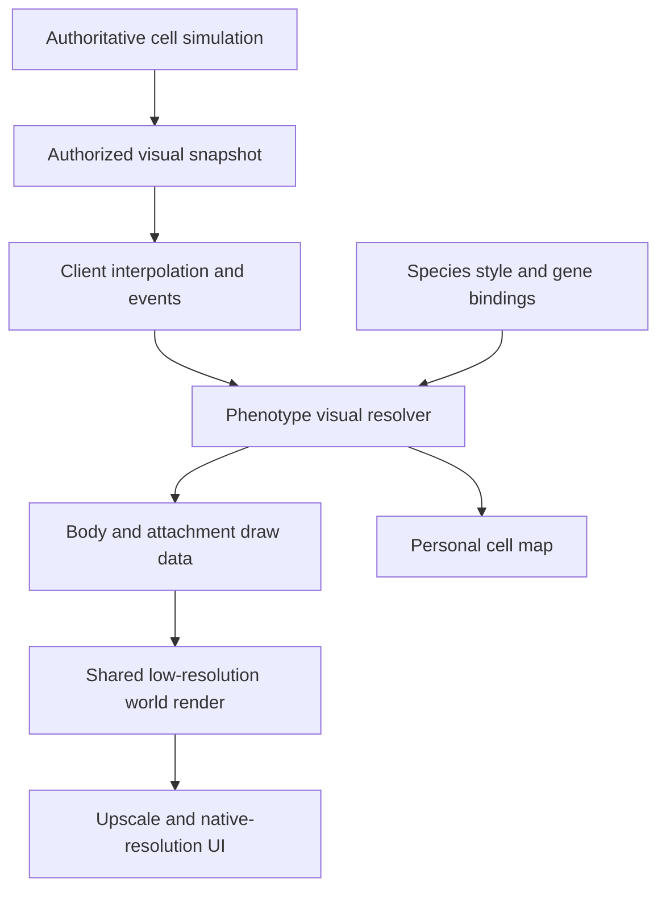
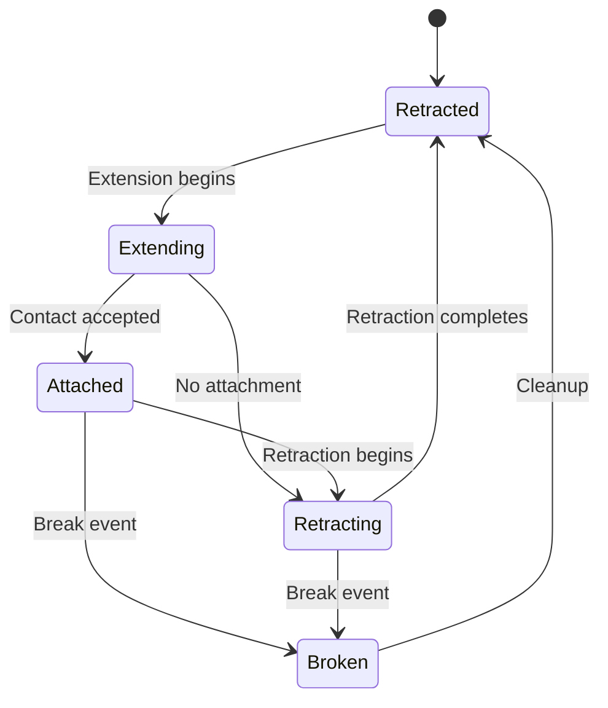

# Prokaryon — Player Cell Visuals Specification

**Document ID:** PROK-VIS-CELL-001  
**Version:** 0.1 — implementation proposal  
**Date:** 2026-09-30  
**Target:** Unity client; authoritative simulation may run locally or on a dedicated server  
**Deliverable:** A dynamic cell renderer combining procedural body geometry/shading with modular pixel-art structures  
**Implementation status:** Specification only. No Unity project, shader compilation, performance measurement, or sprite inspection was performed for this document.

> **Status convention:** **Required** follows the established game concept or is necessary for correctness. **Proposed** is a concrete engineering starting point that can be changed. **Open** identifies a design decision that remains with the designer. All numerical budgets, resolutions, timings, and counts are prototype targets rather than established game balance or measured capacity.

## Contents

1. [Purpose and scope](#1-purpose-and-scope)
2. [Visual language](#2-visual-language)
3. [Architecture choice](#3-architecture-choice)
4. [Runtime architecture and ownership](#4-runtime-architecture-and-ownership)
5. [Coordinates, camera, and pixel grid](#5-coordinates-camera-and-pixel-grid)
6. [Sprite import and asset contract](#6-sprite-import-and-asset-contract)
7. [Procedural cell body](#7-procedural-cell-body)
8. [Palette shading and material appearance](#8-palette-shading-and-material-appearance)
9. [Compositing, clipping, and overlap](#9-compositing-clipping-and-overlap)
10. [Gene-to-visual mapping](#10-gene-to-visual-mapping)
11. [Surface attachment system](#11-surface-attachment-system)
12. [Flagella](#12-flagella)
13. [Pili and other surface structures](#13-pili-and-other-surface-structures)
14. [Intracellular contents](#14-intracellular-contents)
15. [Secretions and environmental effects](#15-secretions-and-environmental-effects)
16. [Growth, division, damage, and death](#16-growth-division-damage-and-death)
17. [Personal cell map and inspection](#17-personal-cell-map-and-inspection)
18. [Multiplayer and snapshot presentation](#18-multiplayer-and-snapshot-presentation)
19. [Visibility and level of detail](#19-visibility-and-level-of-detail)
20. [Performance budgets and profiling](#20-performance-budgets-and-profiling)
21. [Unity project organization](#21-unity-project-organization)
22. [Data contracts and configuration](#22-data-contracts-and-configuration)
23. [Reference algorithms](#23-reference-algorithms)
24. [Granular development checklist](#24-granular-development-checklist)
25. [Acceptance and regression scenarios](#25-acceptance-and-regression-scenarios)
26. [Open decisions](#26-open-decisions)
27. [Failure modes and fixes](#27-failure-modes-and-fixes)
28. [Minimal asset request](#28-minimal-asset-request)
29. [Implementation boundaries](#29-implementation-boundaries)
30. [References](#30-references)

## 1. Purpose and scope

### 1.1 Player-facing goal

The player should recognize their species, see its current physical phenotype, and understand important changes without opening a numerical panel. A cell should visibly grow, construct appendages, accumulate selected storage materials, secrete substances, divide, and die. Its appearance should feel alive and microscopic while remaining readable beside the resource sprites.

The renderer must support the design → observe → adjust loop. A pending gene edit must not immediately alter the physical cell. Existing protein, localization, assembly state, and resource availability determine what becomes visible.

### 1.2 Required constraints

- Gameplay position and movement remain on a single XY plane. Background depth does not introduce a gameplay Z axis.
- Rendering never grants direct player steering or changes simulation outcomes.
- Cells of the same species may differ in size, physiological state, protein abundance, and assembled structures.
- Players can inspect local expression and localization through a separate personal cell map.
- Continuous biological quantities do not require one visible sprite or GameObject per molecule.
- A headless server must not require renderers, cameras, materials, textures, particle systems, or visual animation to advance the simulation.
- Existing resource art must be tested alongside cell art. This document does not assume its true source pixel dimensions, palette, transparency, or pixels-per-unit have been measured.

### 1.3 Initial scope

Implement one capsule-shaped cell, one flagellum style, one retractile pilus style, one membrane patch style, a capsule envelope, a few interior granules, a secretion effect, and division/death presentation. Establish the contracts needed for additional morphology without implementing every shape immediately.

Later extensions may include curved rods, filaments, helical cells, more elaborate colonies, gliding adhesion patterns, and 3D background scenery. Their availability as gameplay features remains undecided.

## 2. Visual language

### 2.1 Proposed art rules

| Property | Proposed rule | Reason |
|---|---|---|
| Cell body | Legible silhouette with broad interior color regions | Works at small apparent sizes |
| Cytoplasm | Four to six authored color bands | Gives volume without smooth gradients |
| Membrane | Approximately one logical pixel at normal zoom | Separates the cell from its surroundings |
| Detail | Clustered marks, never uniform television-like noise | Suggests complexity without visual static |
| Lighting | Stable upper-left highlight in the prototype | Makes volume consistent across species |
| Motion | Small, low-frequency body deformation; purposeful appendage motion | Avoids a gelatinous cartoon appearance |
| Species identity | Body palette plus a stable surface-pattern family | Distinguishes species without relying only on hue |
| Ownership | Optional outline/bracket UI | Does not compete with biological pigmentation |
| Background | Lower contrast and reduced detail relative to the gameplay plane | Preserves foreground readability |
| Selection | Thin external contour or brackets; no mandatory bright full-body glow | Keeps the cell's own color visible |

These rules are a proposed direction, not approval of a final style. The body may suggest translucent material while remaining mostly opaque in the normal view. Full physical transparency is not required.

### 2.2 What should be readable at each scale

| View | Information that must remain legible |
|---|---|
| Normal gameplay | Species silhouette, growth, major appendages, capsule, division, severe damage |
| Close view | Surface patches, granules, secretion origins, appendage growth |
| Personal cell map | Actual abundance, functional activity, localization, target expression, pending edits |
| Distant overview | Position, approximate size, species grouping, alive/dead state where authorized |

Do not place every biochemical state in the normal view. In particular, absence of an ATP icon must not imply absence of ATP, and a glowing cell must not expose hidden resource measurements to another player.

## 3. Architecture choice

| Approach | Strengths | Costs and risks | Disposition |
|---|---|---|---|
| Pre-drawn sprite combinations | Excellent manual control; straightforward initial rendering | Combinatorial assets for growth, angle, phenotype, and division | Useful for attachments and fallback silhouettes |
| Procedural body plus modular sprites | Continuous growth and deformation; reusable art; explicit phenotype mapping | Custom masking, shading, sorting, and pixel-stability work | **Proposed baseline** |
| Low-resolution 3D cell | Natural volume; strong lighting possibilities | Modeling workload, more expensive rendering, possible style mismatch | Keep as a future alternative |
| Per-cell offscreen composition | Convenient self-contained composite sprite | Camera/target management and memory cost scale with cell count | Use only for one inspector/portrait if needed |

### 3.1 Proposed body renderer

Start with a shared quad and an analytic signed-distance-function (SDF) shader for an undeformed capsule. An SDF returns a negative value inside the shape, zero at its boundary, and a positive value outside. The shader can derive the fill, membrane ring, capsule envelope, and selection outline from that value.

A shape-query implementation on the CPU supplies attachment positions, conservative bounds, and debug contours. Keep its parameters aligned with the shader.

Move to a sampled contour mesh only when a required morphology cannot be expressed cleanly by the initial analytic shapes. Avoid implementing both systems fully before the capsule prototype proves the style.

### 3.2 Renderer compatibility gate

**Proposed starting environment:** a pinned Unity 6 editor release, URP, and an orthographic camera. The exact editor patch and matching URP package version are **Open**. Do not upgrade packages mid-prototype without recording and checking the change.

A URP 2D Renderer is a sensible first spike because existing resources are sprites. Custom body shaders need a render pass compatible with that renderer. Test a body quad, one resource sprite, and the intended sorting behavior before building the full visual system. If a Universal Renderer proves simpler for custom mesh/SDF work, document that choice and use the explicit low-resolution render-target route in Section 5.

Unity's Pixel Perfect Camera, Render Graph integration, and batching paths are version-dependent. Verify against the pinned editor/package combination rather than copying unrelated render-pipeline examples. Relevant official references are listed in Section 30.

## 4. Runtime architecture and ownership



### 4.1 State ownership

| State | Owner | Renderer responsibility |
|---|---|---|
| Position, orientation, velocity | Simulation | Interpolate approved snapshots |
| Cell dimensions and division progress | Simulation | Present shape continuously |
| Promoter activity and protein abundance | Simulation | Display authorized values |
| Functional flagella/pili and mechanical attachments | Simulation | Animate corresponding structures |
| Species style identifier | Validated content/species system | Resolve bounded palette and pattern |
| Fine granule placement and subtle shimmer | Client visual system | Seeded, bounded decoration |
| Secretion concentrations and toxicity | Simulation | Draw cues without affecting chemistry |
| Particle count | Client visual system | Budgeted representation of activity |
| Selection, hover, inspector layout | Client UI | Present without modifying biology |

### 4.2 Update sequence

1. Receive or generate authoritative simulation state.
2. Validate IDs, revisions, dimensions, counts, and finite numeric values at the boundary.
3. Buffer snapshots and lifecycle events.
4. Sample presentation state at a single presentation timestamp.
5. Resolve visual phenotype when relevant inputs change.
6. Determine visibility and level of detail (LOD).
7. Evaluate body parameters and surface anchors for visible cells.
8. Evaluate budgeted appendage animation and interior decoration.
9. Submit grouped draw data.
10. Render the shared world target, upscale, then render readable UI.

Use a manager or system to update visible cells in batches. A MonoBehaviour per cell is acceptable in an early prototype; one independent Update method per protein or filament segment is not a suitable production architecture.

### 4.3 Three clocks

- **Simulation time:** authoritative growth, movement, assembly, division, chemistry.
- **Presentation time:** interpolated simulation time, used consistently for motion and events.
- **Cosmetic phase:** derived from presentation time plus stable structure seed; never advances the simulation.

For single-player/local testing, feed the same snapshot interface directly. Avoid maintaining a separate local-only rendering model that later needs to be rewritten for networking.

## 5. Coordinates, camera, and pixel grid

### 5.1 Coordinate systems

| Space | Meaning | Rule |
|---|---|---|
| Simulation | Gameplay XY position and physical dimensions | Continuous floating-point or chosen simulation representation |
| Cell local | Cell center at origin; long axis along local +X | Shape dimensions in consistent world units |
| Surface | Normalized contour coordinate or explicit pole/side attachment | Stable across growth |
| Logical screen | Low-resolution render-target pixels | Shared pixel lattice for cells and resources |
| Display | Physical output pixels | Integer upscale where possible |
| UI | Canvas/display coordinates | Independent of world pixelation |

Do not equate one Unity unit to one micrometer until the broader simulation scale is defined. Store any scientific scale conversion separately. Avoid nonuniform Transform scale for the cell; pass length and width as shape parameters so outlines and appendages retain predictable dimensions.

### 5.2 Proposed baseline

| Setting | Prototype starting point |
|---|---|
| Logical resolution | 640 × 360 |
| Alternative comparison | 480 × 270 |
| Display target | 1920 × 1080, giving 3× or 4× integer enlargement |
| Art density | 32 logical pixels per world unit at baseline zoom |
| Reference cell | 1.5 units long × 0.75 units wide, approximately 48 × 24 logical pixels |
| Camera | Orthographic |
| World-target filtering | Point |
| Mipmaps | Off for native-scale sprite art and world color target |
| Antialiasing | Off for baseline pixel-art color pass |
| Dynamic render scaling | Off in initial visual validation |
| Body palette | Authored ramp, nearest palette lookup |

At fixed logical height H, orthographic half-height S, and cell world size L, its projected extent is approximately `L * H / (2*S)` logical pixels. With H = 360 and 32 pixels/unit, S = 5.625 units. Treat these as tuneable art settings.

### 5.3 Shared world target

Implement **one** route:

**Route A — URP Pixel Perfect Camera:** configure a reference resolution and the compatible upscale-render-texture option. Let that component own the world pixel-grid behavior. Do not add a second pixelation blit that resamples the same image again. Unity documents these controls in [U1].

**Route B — explicit render target:** render the world camera into a persistent low-resolution color target with a matching depth target when required. Present the color target with point sampling in a centered viewport or full-screen presentation pass. Recreate targets only when their logical size or format changes. Native-resolution UI renders after presentation. Custom URP passes should follow the pinned release's Render Graph APIs [U2].

Keep resource sprites, cell bodies, appendages, and near environmental particles in the same low-resolution world pass. A distant background may render separately, but its softness and density must be deliberately art-directed. Do not apply depth-of-field blur to the foreground cells or their pixel outlines by default.

### 5.4 Aspect ratios and zoom

**Proposed baseline:** fixed logical height, integer display scale, centered letterbox/pillarbox when needed. Record the actual displayed viewport rectangle for pointer mapping.

- Offer a small number of approved zoom levels first. Smooth zoom can be tested later for shimmer.
- At different zoom levels, resource sprites and procedural bodies must change apparent size together.
- At very small sizes, switch to a simplified representation rather than preserving every subpixel filament.
- At close zoom, decide whether the player sees larger pixels or additional detail. The proposed default is larger pixels plus the personal cell map for detailed inspection.
- Ultrawide gameplay field of view is a gameplay decision; do not silently reveal more competitive information because a window is wider.

### 5.5 Pixel stability

Rasterization into a shared low-resolution target establishes the final grid. Keep motion and physics continuous. Do not round authoritative positions, collision shapes, or forces to pixels.

Camera movement, fine one-pixel geometry, and rotation can still produce temporal stepping. Compare smooth camera motion against pixel-snapped presentation-camera motion. If snapping is used, apply it to the presentation camera or an explicitly defined render offset, never inconsistently to separate body parts.

Do not quantize body UVs, attachment vertices, and the final screen independently. Multiple unrelated grids cause parts to drift or pulse. Use integer upscale for stable square pixels; accept that very thin moving lines may change coverage, and tune minimum thickness rather than adding global blur.

### 5.6 Pointer mapping

Subtract the letterbox viewport origin from pointer position, divide by the display scale, and map the resulting logical pixel coordinate through the world camera. Reject input outside the rendered viewport. Use simulation-space hit testing for selecting cells; selection does not command movement. Inspector coordinates use a separate transform.

## 6. Sprite import and asset contract

### 6.1 Audit existing resource sprites

Before choosing final pixel density, inspect each source at 1:1:

- Record actual width and height, alpha channel, opaque bounding box, and intended logical pixel size.
- Check whether apparent pixels are already enlarged blocks inside a much larger image.
- Check for baked backgrounds, semitransparent edge halos, accidental antialiasing, and uneven block sizes.
- Normalize import scale without assuming all source files share the same logical resolution.
- If downsampling is necessary, review the result manually; nearest-neighbor reduction cannot recover a clean pixel grid from arbitrary mixed-size blocks automatically.

No sprite files have been inspected as part of this specification. The game should not infer palette assignments for resources from filenames.

### 6.2 Proposed import profile

- Texture type: Sprite where SpriteRenderer is used; ordinary texture for shader atlases.
- Pixels Per Unit: shared art-density convention after normalization.
- Filter Mode: Point.
- Mipmaps: disabled for the intended near-scale sprites.
- Wrap: Clamp unless a texture is explicitly tileable.
- Compression: disabled during art validation; profile platform compression later for color/alpha damage.
- Color textures: sRGB as appropriate to the project's color pipeline; numeric masks and distance data: linear data.
- Pivot: explicit and consistent; appendage sprites use an attachment-root pivot.
- Atlas: padded regions, UV inset or clamping, and no rotated packing for shaders that assume unrotated rectangular regions.
- Mesh type: use full rectangular quads for procedural clipping shaders that need all of the UV region; tight sprite meshes can remove necessary fragments.

Keep original art and runtime-processed art separately so normalization is reproducible. Atlas layouts are content data; shaders must not hard-code pixel coordinates that change when packing changes.

### 6.3 Required attachment metadata

Each attachment asset definition contains an asset ID, atlas region, root pivot, nominal size in world units, allowed scale range, orientation convention, palette channel, local bounds, visual type, LOD policy, and optional frame rate/frame list.

Anchor placement and biological compatibility belong to gene/phenotype data, not to the PNG itself.

## 7. Procedural cell body

### 7.1 Shape contract

Support the following queries from one shape parameter set:

- Signed distance or inside/outside query at a local position.
- Surface point and outward normal at a surface coordinate.
- Conservative local/world bounds.
- Interior point validation with a margin.
- Approximate area for debugging, separate from authoritative biomass.
- Optional closest surface point for editor/debug use.

Shader and CPU shape math must agree to within a proposed half-logical-pixel tolerance at normal zoom. Exact GPU/CPU bitwise equality is unnecessary, but disagreement must not make attachments visibly float.

### 7.2 Capsule SDF

Let `L` be total body length, `W` be total width, `r = W/2`, and `h = max(0, L/2-r)`. Require `L >= W > 0` for the capsule family.

For local point `p = (x,y)`:

```text
nearestAxisPoint = (clamp(x, -h, h), 0)
d = length(p - nearestAxisPoint) - r
```

The capsule body is `d <= 0`. Its area is `4*h*r + pi*r*r`. This equation describes geometry; it does not specify a new biological mass model.

At `h = 0`, the capsule becomes a circle. If a proposed morphology requires width greater than length, use a different shape definition or rotate/reparameterize it explicitly.

### 7.3 Body layers from distance

For membrane thickness `m`, capsule-envelope thickness `c`, and selection-outline thickness `s`:

```text
cytoplasm:       d < -m
membrane:      -m <= d <= 0
capsule:        0 < d <= c
selection:     c < d <= c+s    (only for selected cells)
```

The selection outline must surround the outer envelope when present. Convert a desired logical-pixel thickness to world units using the active presentation camera. Choose whether wall/capsule biological thickness also affects the silhouette independently; do not equate a one-pixel styling line with a physical membrane thickness.

### 7.4 Quad and bounds

Use a reusable unit quad whose vertices are positioned to cover the body plus maximum active envelope and outline. Do not resize the quad without updating the mapping back to physical local coordinates. An expanded quad with unchanged shape coordinates must leave the actual body size unchanged.

Body culling bounds include all shader-generated outer regions. Appendages have their own bounds or extend the cell's combined visual bounds. Update bounds when dimensions, capsule, or appendage extent change. A shape produced outside its mesh bounds may vanish prematurely at the screen edge.

### 7.5 Controlled deformation

Initial version: rigid capsule with continuous length/width changes; no ambient deformation required.

Later: a small centerline bend or bounded surface perturbation. Limit proposed idle deformation to roughly 0.25–0.5 logical pixel at normal zoom. This is visual only. Apply the same deformation mapping to anchors and interior placement, or restrict the effect to shading so geometry stays consistent.

An arbitrary warped SDF is not necessarily an exact distance field. Outline width and normals then become approximate. Re-distance, use a contour method, or accept and quantify a bounded visual error; do not assume all SDF formulas remain exact after warping.

### 7.6 Future shape strategy

| Shape | Plausible implementation | Main additional concern |
|---|---|---|
| Circle/coccus | Capsule with zero straight segment | Pole semantics may need a polarity axis |
| Curved rod | Distance to sampled curved centerline or contour mesh | Stable anchors and distance accuracy |
| Filament | Chain/curve with radius profile | Culling, overlap, and length-dependent detail |
| Helical projected body | Explicit projected contour or mesh | A 2D projection should remain consistent with planar gameplay |
| Irregular soft body | Contour points with constrained deformation | Self-intersection, triangulation, higher cost |

Each new family implements the same shape-query interface. Collision shape policy remains a simulation decision; visual geometry is not automatically a collision mesh.

## 8. Palette shading and material appearance

### 8.1 Pseudo-volume

For an undeformed capsule, compute distance `rho` from the nearest point on its centerline. For interior pixels, construct a pseudo-normal:

```text
nx = (x - nearestAxisPoint.x) / r
ny = y / r
nz = sqrt(max(0, 1 - nx*nx - ny*ny))
Nlocal = (nx, ny, nz)
Nworld = rotate Nlocal.xy by the cell's world orientation; preserve nz
brightness = saturate(ambient + diffuse * max(0, dot(Nworld, LightDirection)))
```

This is an artistic approximation to a rounded capsule, not a physically simulated cell surface. For a globally fixed light direction, transform the normal as shown so highlights do not rotate as painted markings would.

### 8.2 Palette lookup

Map brightness through an authored ramp rather than multiplying a base color continuously. Quantize to N entries and clamp the index to `0..N-1`. Store each ramp as a row in a small point-filtered palette texture or equivalent bounded shader data.

Keep the membrane and capsule colors independently adjustable. Avoid using species tint as a blanket multiplier on nutrient sprites, selection outlines, and every intracellular material.

### 8.3 Texture and variation

- Use a stable small tileable texture or deterministic low-frequency field sampled in cell-local coordinates.
- Anchor texture phase to a stable cell/species seed.
- Restrict variation to adjacent palette entries or subtle patch coverage.
- Do not call a time-varying random function per pixel for cytoplasm.
- Choose whether texture stretches with growth or reveals new regions. The first prototype may stretch slightly; a later growth-aware mapping can reduce visible stretching.
- Never assign a new seed on every phenotype update.

### 8.4 Transparency

**Proposed default:** opaque cytoplasm with internal contents drawn on top and clipped inside the body, producing an illustrative cutaway/translucent impression.

Use true alpha blending sparingly for an outer capsule or secretion clouds. Multiple translucent layers increase overdraw and can produce muddled overlap colors. An optional stippled opaque envelope avoids blending but must be tested for flicker and texture noise. Select one baseline appearance before adding both paths.

### 8.5 Damage and physiological cues

Drive each cue from an explicit authorized state: membrane disruption, depleted storage, assembly failure, or death stage. Proposed cues include interrupted membrane marks, reduced cytoplasmic contrast, or localized lesions.

Do not make all stress equivalent to a red tint. Reserve UI alerts for precise state and let world appearance show only the biological effects intended to be visible. Severe status indicators must remain distinguishable in grayscale or through shape/icon redundancy.

## 9. Compositing, clipping, and overlap

### 9.1 Local draw order

Use a consistent back-to-front cell composite:

1. Rear appendages and rear effects.
2. Capsule envelope.
3. Cytoplasmic body.
4. Interior structures and granules, clipped inside the membrane.
5. Surface patches and membrane outline where needed.
6. Front appendages and foreground effects.
7. Selection/hover decorations.

An SDF body shader can combine several of these into one pass. The list specifies visual order, not a requirement for seven draw calls per cell.

### 9.2 Per-cell clipping

For an interior sprite fragment, transform its world position into its owning cell's local coordinates. Evaluate the owner's shape and discard the fragment unless it is inside `d < -interiorMargin`. Pass owner shape parameters explicitly.

This avoids a shared mask accidentally revealing cell A's granules through cell B. It also avoids assuming that a SpriteMask automatically clips arbitrary custom shaders. Unity's SpriteMask behavior and batching constraints must be checked if that alternative is used [U5].

A stencil buffer can work, but a naive unique stencil reference per cell does not scale to arbitrary cell counts and introduces ordering constraints. Do not make it the default without a clear reuse scheme.

### 9.3 Inter-cell overlap

**Proposed prototype:** one stable composite group per visible cell, ordered by a chosen planar painter rule and stable cell ID as tie-breaker. Treat each group as a unit. The same cell's interior must not be rendered over another cell that should occlude it.

For production, benchmark either:

- Painter-sorted per-cell groups with pooled renderers/combined local meshes; simple correctness, potentially more draws.
- Depth-aware opaque body rendering with per-cell depth slots and local layer offsets; better grouping opportunities, more depth/transparent-appendage complexity.

Do not globally draw every body and then every granule with depth disabled; that makes background-cell contents appear over foreground cells. Instancing does not eliminate ordering requirements. Gameplay remains planar even if tiny rendering-only Z offsets are used.

### 9.4 Long appendages

Decide whether a filament belongs entirely behind/in front of its cell or can cross it. Begin with attachment-side classification and simple clipping at the root. When crossing other cells, use the selected painter/depth policy consistently. Do not promise physical filament interweaving without implementing an appropriate occlusion system.

## 10. Gene-to-visual mapping

### 10.1 Biological quantities remain distinct

| Quantity | Meaning | Example visual |
|---|---|---|
| Pending edit | Genetic change awaiting maturation | Timer/ghost in inspector only |
| Promoter output | Current transcription drive | Activity trace in inspector |
| Protein abundance | Existing translated protein | Inspector density or compatible surface coverage |
| Localized abundance | Protein present in a specified region | Localized membrane patch |
| Assembled structure | Functional physical apparatus built from components | Flagellum, pilus, envelope |
| Activity | Current functional operation | Beating/rotation, secretion, transport pulse |

These are not interchangeable. A promoter can be off while protein and an assembled structure remain. A structure can be present but inactive because ATP or another required input is unavailable.

### 10.2 Binding definition

Each gene/feature visual binding declares:

- Stable feature ID and compatible gene/module IDs.
- Source quantity: abundance, assembled count, activity, stored amount, or damage.
- Source compartment or localization channel.
- Mapping curve and normalization range.
- Representation: surface patch, discrete structure, interior granule, tint channel, or emitted effect.
- Atlas/style asset and palette channel.
- Minimum/maximum apparent size and count.
- LOD behavior and inspection visibility.
- Assembly/disassembly animation hooks.
- Observer access policy.

Resolve bindings into a small visual state rather than giving each gene an arbitrary script that manipulates renderers directly. New content should mostly be data plus an existing visual primitive.

### 10.3 Biological scaling versus display scaling

The game's gene expression-scaling curve defines biological function. A separate display curve defines how much of that state can be shown in a few pixels.

For example, Fluxidase catalytic capacity may scale linearly with abundance, while its inspector glyph density saturates at twelve representative marks. The inspector's numeric value remains accurate. The capped glyph count must not cap metabolism.

For a continuous visual channel, a useful configurable mapping is:

```text
u = clamp((authorizedValue - displayMin) / (displayMax - displayMin), 0, 1)
visualAmount = DisplayCurve(u)
```

Validate `displayMax > displayMin`; invalid bindings use a visible developer fallback rather than division by zero. Display curves may be linear, saturating, thresholded, or stepwise, but they must be labeled as presentation choices.

### 10.4 Discrete structures

If flagella/pili have gameplay significance, consume authoritative structure IDs and assembly progress. Do not infer the number of working flagella by rounding promoter output independently on every client.

If the early simulation only models continuous motility capacity, decorative filament count may be inferred temporarily, but document that abstraction. Use deterministic thresholds and hysteresis to avoid count flicker. It must not create false claims about individual filament damage or attachment.

### 10.5 Example mappings

| Feature | Normal gameplay | Personal cell map | Required input |
|---|---|---|---|
| ATP Synthase | No mandatory individual enzyme sprites | Authorized abundance/activity overlay | Actual abundance and activity |
| Fluxidase | No mandatory physical organelle | Cytoplasmic distribution overlay | Actual localized abundance |
| Glycon Permease | Optional membrane patches at sufficient density | Regional membrane abundance | Membrane localization |
| Glycon Hydrolase | Secretion cue when exported and active | Production/export/activity readouts | Actual secretion flux |
| Flagellar apparatus | Filaments that assemble and animate | Structure state and local abundance | Assembly state plus motor activity |
| Capsule production | Envelope thickness/coverage | Material amount and integrity | Physical envelope state |
| Storage material | A bounded number of interior granules | Exact storage amount plus units | Stored quantity |

The table does not introduce new resource stoichiometry, organelles, or gene prerequisites. In particular, do not depict ATP Synthase in a different compartment merely because a real-world reference suggests one; respect the game's configured localization, including the existing Cytosol card unless the designer revises it.

### 10.6 Delayed edits

1. Edit submitted: show a pending UI entry; world phenotype stays unchanged.
2. Edit matures according to authoritative rules: new gene configuration becomes active.
3. Abundance/localization changes according to the simulation.
4. Assembly or disassembly advances if modeled.
5. Renderer displays the changing physical state.

Do not add an unrelated biological delay in the renderer. Cosmetic interpolation may smooth a snapshot transition, but it must not make an operative structure invisible for a long interval or suggest functionality before activation. Treat assembly progress as authoritative if its timing matters to play.

## 11. Surface attachment system

### 11.1 Anchor record

Store stable structure ID, owner cell ID, anchor mode, surface coordinate or explicit pole, outward/inward orientation, radial offset, attachment size, side/depth policy, and seed.

Anchor modes proposed for the initial system:

- Fixed normalized position around the boundary.
- Positive or negative polarity pole.
- Named surface region populated by deterministic slots.

Later additions can support a localized abundance field or dynamic biological transport. A light-facing or chemical-facing location must come from the cell's authorized sensing/regulatory system, not from the renderer querying every environmental field directly.

### 11.2 Stable capsule parameterization

For the baseline capsule, define `u in [0,1)` as normalized perimeter distance, starting at the rightmost pole and proceeding counterclockwise. Perimeter is `P = 4*h + 2*pi*r`.

Traverse: upper-right quarter arc, top straight segment, left semicircle, bottom straight segment, lower-right quarter arc. Reference math is provided in Section 23. Explicit pole anchors should use `(h+r,0)` and `(-h-r,0)` rather than relying on a generic perimeter fraction if pole identity must remain fixed.

For a tangent `T`, derive the outward normal `N` consistently. Place a structure root at `surfacePoint + N * radialOffset`. Build its orientation from N/T and a configured mounting angle.

### 11.3 Anchor stability during growth

A normalized perimeter coordinate preserves order but does not represent conserved membrane material. Some anchors can move relative to the straight/curved boundary during elongation. Decide whether a structure is:

- Pole-locked.
- Distributed by current surface area/perimeter.
- Attached to material coordinates that stretch with growth.

Use pole locks for polar appendages and distributed stable slots for generic membrane patches. Do not repeatedly randomize every structure when one gene changes.

### 11.4 Localization as a field

For a first regional model, represent membrane localization using 16 bins around the perimeter. Interpolate for drawing; normalize only when the values are defined as fractions. If bins contain absolute abundance, preserve their sum and units.

Map each potential decorative slot to a bin and use the bin's abundance to determine visibility/size. Use per-slot stable thresholds to reduce synchronized popping. More accurate spatial simulation can later supply more bins without changing the rendering concept.

### 11.5 Occupancy and occlusion

Prevent obvious attachment intersections with a minimum arc-distance rule for large structures. Small protein patches may overlap within a density cap. An authoritative physical structure must not disappear because the decorative packing algorithm is full; reserve slots or simplify its rendering instead.

Root placement should include the appropriate membrane/wall/capsule offset. Whether a flagellum pierces a capsule or is partly hidden by it is an art/biology rule to define per structure.

## 12. Flagella

### 12.1 Representation

Use a sampled centerline with a thin ribbon mesh, or a custom line shader tested under the shared pixel grid. A Unity LineRenderer is acceptable for the first isolated experiment, but hundreds of component-per-filament renderers may become costly. Store curves as data so the rendering backend can later combine them.

Proposed close-view sample count: 12–20 segments per filament; medium view: 6–10; distant view: a simplified tail or no filament. These are starting values, not limits on biological structures.

### 12.2 Root and wave

Let `s in [0,1]`, root R, outward/root direction D, and perpendicular B. A stylized curve can use:

```text
C(s,t) = R + D*(length*s) + B*(amplitude*s*s*sin(k*s - phase(t)))
```

The `s*s` envelope keeps the root stable and its initial tangent aligned with D. Add a bounded trailing bend based on local flow or cell velocity if those values are available. This curve is a visual projection of an appendage, not a biomechanical model of bacterial flagellar rotation.

Store or reconstruct phase continuously. If activity changes the angular frequency, integrate phase with elapsed presentation time rather than setting `phase = currentFrequency * totalTime`, which causes discontinuities when frequency changes. A server phase is unnecessary unless visible phase affects gameplay.

### 12.3 Activity and exhaustion

- Assembly progress controls visible filament length or a dedicated construction sequence.
- Motor activity controls animation speed within an artist-defined range.
- Inactive filaments remain present and may trail with flow.
- Loss of ATP should stop or slow active movement according to simulation state, without deleting the filament.
- Damage or shedding uses a structure event, not a random cosmetic disappearance.

Do not infer force from the rendered curve. The simulation supplies propulsion independently.

### 12.4 Ribbon generation

For each centerline sample, estimate tangent from neighboring points and compute a perpendicular. Add two vertices at half-width along that perpendicular and join consecutive pairs with triangles. Use consistent winding and UV direction.

Guard against coincident samples and zero-length tangents. Near sharp bends, clamp join expansion to avoid spikes. Include full maximum displacement in bounds. Avoid physical colliders or joints per visual segment.

### 12.5 Pixel visibility

Use a proposed minimum apparent width of one logical pixel for a close/normal-view filament. A small amount of artistic width exaggeration is preferable to a disappearing line, but it must not enlarge collision range. At distance, switch representation instead of holding an implausibly thick line across the entire screen.

## 13. Pili and other surface structures

### 13.1 Pilus state machine



If pili move the cell, the simulation owns extension length, contact success, target, and retraction. A local random raycast must not decide attachment success independently from the server.

Draw an unbound pilus from its surface root along a configured direction. A bound pilus ends at a world anchor or at a target entity's local attachment coordinate. Resolve moving targets from the same presentation time as the owner. If the target becomes unavailable, use the protocol's detach event or a bounded stale-endpoint fallback, not an indefinitely stretched line.

### 13.2 Membrane patches

Represent numerous transporters/receptors as a limited number of patches. Increase coverage, density, or patch intensity as authorized abundance increases. Surface sprites must inherit boundary orientation and remain flush with the body.

Use distinct motifs only when they communicate a meaningful difference. A different sprite for every enzyme is unnecessary. Fine identity belongs in the inspection overlay.

### 13.3 Gliding and adhesion

If gliding is implemented, show localized contact patches or a subtle traveling pattern along the substrate-facing region. Physical movement still comes from simulation. Do not render moving adhesion belts on the non-contact side unless that is the chosen art convention.

Adhesion can be communicated by a stationary contact mark or short tether. A visual attachment to a cave wall requires an actual substrate/contact state. The background image alone cannot provide it.

### 13.4 Capsule envelope

Use an outer SDF band with bounded opacity or authored stipple. Feed thickness and integrity from the physical phenotype. Avoid equating increased opacity with increased thickness unless explicitly configured.

The capsule should not obscure the membrane enough to hide cell shape. At low LOD, a slightly expanded silhouette/rim can replace the full envelope effect.

## 14. Intracellular contents

### 14.1 Representative contents

Use a bounded set of granules and internal markings. These are visual aggregates, not individual molecules and not necessarily membrane-bound organelles.

Proposed close-view limit: 8–16 granules; normal view: 3–8; distant view: none. One selected cell may show a denser inspector overlay without changing the world simulation.

### 14.2 Placement

Generate deterministic candidate positions from stable cell seed and slot index. Accept a candidate only if the body distance is less than `-(granuleRadius + clearance)` and it does not overlap reserved structure space excessively.

Use a bounded number of candidate attempts, such as eight per slot. If no placement is valid, hide a decorative slot rather than looping indefinitely. Recompute only when shape changes enough to invalidate placements, or use normalized coordinates with revalidation.

During growth, retain valid existing positions and add/reveal new slots. Preserve stable slot order so a tiny storage change does not rearrange the whole interior.

### 14.3 Motion

Use bounded, slow local drift around a stable anchor. Do not create a Rigidbody per granule. Before accepting a drifted position, verify it remains inside the allowed interior. Shader clipping is the final containment layer, not the sole positioning strategy.

At very small cell sizes, suppress drift to prevent flicker. Decorative cytoplasmic motion may be disabled as an accessibility or performance setting.

### 14.4 Resource identity

Resource sprites may be reused as inspector icons. In the normal cell body, use simplified storage representations where full resource icons become cluttered. Only depict a resource as stored if the gameplay actually supports intracellular storage for it.

Resource IDs refer to a shared registry. Adding later resources must not require recompiling the cell renderer or assigning every resource its own hard-coded shader property.

## 15. Secretions and environmental effects

### 15.1 Separate field simulation from particles

The simulation owns extracellular resource/enzyme/toxin fields or entities. Particles are sampled indicators of a flux. A particle disappearing from the screen must not consume a resource; a particle pool being exhausted must not stop secretion.

### 15.2 Emission mapping

For secretion rate q, use an artist-configured saturating or logarithmic display rate capped by a global particle budget. Accumulate fractional births:

```text
birthAccumulator += visualEmissionRate * deltaTime
requestedBirths = floor(birthAccumulator)
birthAccumulator -= requestedBirths
spawnedBirths = min(requestedBirths, availableBudget)
```

Drop unrendered births when the budget is full. Do not create a delayed flood of particles after the camera returns or a pool frees up. Limit births per frame to bound sudden spikes.

### 15.3 Position and movement

- Start particles at authorized secretion locations, not uniformly around the cell unless secretion is uniform.
- Use a coarse flow sample or supplied local flow for advection.
- Add bounded diffusion-like jitter as decoration.
- Use short lifetimes and palette-compatible sprites.
- Distinguish active export from intracellular production in the inspector.

If particles are intended to represent actual discrete resource entities, they belong to the world resource renderer and entity lifecycle, not this cosmetic emission system.

### 15.4 Pooling and budgets

Pool particle records and render batches. Use one shared system per effect family or material where possible, not a permanent ParticleSystem for each gene in each cell. Limit particle work by screen visibility and screen coverage, including large overlapping secretion clouds.

## 16. Growth, division, damage, and death

### 16.1 Growth

Interpolate authoritative dimensions. If biomass determines dimensions, the simulation or a shared phenotype layer supplies that mapping. The renderer does not invent a second biomass-to-size equation.

For a constant-width capsule, area varies as `4*h*r + pi*r*r`; uniform scaling instead changes area quadratically. This distinction matters if apparent size is meant to communicate mass. Pick the biological convention explicitly.

Re-evaluate anchors and interior validity after dimensional changes. Do not rebuild unrelated palette/material assets. Small parameter changes should update draw data only.

### 16.2 Division phases

| Phase | Authoritative signal | Presentation |
|---|---|---|
| Preparing | Division state active | Continued growth/elongation |
| Constricting | Progress and division plane | Waist narrows; interior regions separate |
| Split | Parent/daughter identity event | Parent view replaced or handed off to daughters |
| Separating | Daughter positions and states | Daughters become independently rendered cells |

Division progress is not a wall-clock animation that creates daughters by itself. The simulation controls success, cancellation, arrest, daughter count, and identity.

### 16.3 Prototype constriction field

For body centerline coordinate x, use a local radius profile as an artistic implicit shape:

```text
rLocal(x) = r * (1 - constriction * exp(-(x*x)/(waistWidth*waistWidth)))
q = (x - clamp(x,-h,h), y)
f = length(q) - rLocal(x)
```

Here `constriction` is bounded below 1 while the parent remains one connected body, and `waistWidth > 0`. The field is not an exact SDF. For a locally improved distance approximation near the boundary, use `f / max(length(gradient(f)), epsilon)` and verify the result visually. CPU anchor queries must use the same implicit profile or a sampled contour; the undeformed capsule anchor formula is insufficient at the waist.

For a cleaner later implementation, construct a division contour or smoothly combined daughter-lobe shapes and maintain a compatible CPU query. Avoid an unreviewed minimum of two circles: it can visibly change area or pop topology near separation.

### 16.4 Division continuity contract

Supply parent ID, daughter IDs, split timestamp, daughter poses/dimensions, and structure-inheritance mapping when structures persist. The last parent silhouette and first daughter silhouettes should align closely enough to avoid an apparent teleport.

- Divide or redistribute visual contents using the authorized inheritance state.
- Transfer stable structure IDs to the appropriate daughter when biologically retained.
- Derive new cosmetic seeds from stable lineage/event data rather than reseeding every frame.
- Present exactly one logical representation of each entity at a timestamp; no visible parent plus duplicate daughters after the split.
- For late arrival, seek directly to the correct lifecycle stage rather than replaying an obsolete full division animation.
- Track the selected lineage to the selected surviving daughter according to gameplay/UI policy.

Visual area conservation is a continuity target, not permission to alter authoritative daughter mass. If current simulation dimensions imply a discontinuity, expose it in a debug metric and resolve the simulation/presentation contract.

### 16.5 Damage

For regional damage, supply affected surface bins or event location. Use a bounded lesion pattern anchored to the cell, not an arbitrary full-body flicker. For aggregate integrity, use a global degradation cue and keep detailed lesions decorative.

Collision geometry must not follow every missing outline pixel. If wall rupture changes collision or permeability, it requires a simulation event/state.

### 16.6 Death and despawn

1. Receive death event and authoritative time.
2. Stop activity-driven animation according to state; leave passive motion if relevant.
3. Play the configured death presentation: collapse, rupture, or fade, once the design is selected.
4. Show debris only as budgeted visual effects unless the simulation spawned actual resources.
5. Release pooled visual objects when the presentation expires or the entity leaves relevance.

Switching to another living player cell must not depend on waiting for the death effect to finish. Logout removal is a separate despawn reason and should not emit fake death resources or effects unless the designer chooses that presentation.

## 17. Personal cell map and inspection

### 17.1 Purpose

Display local expression and protein localization accurately enough for optimization. Use the same phenotype snapshot and shape functions as the world renderer so the diagram agrees with the visible cell.

### 17.2 Proposed layout

- Enlarged cell diagram with selectable surface/interior regions.
- Gene/construct list linked to diagram highlights.
- Toggle between abundance, activity, and localization overlays.
- Separate target-expression indicator and actual protein-abundance indicator.
- Pending-edit queue with authoritative maturation status and concurrency limit.
- Structure list with assembly/active/damaged state.
- Resource values only for the player's authorized inspection scope.
- Time series or short history for selected channels, sampled at a bounded rate.

Use a maximum of one shared inspector render target, reused when the selected cell changes, or draw the diagram directly in UI. Do not allocate one inspector camera/target for every population member.

### 17.3 Numeric integrity

Label quantities and units explicitly. A display color ramp must not imply absolute concentration when it is normalized to the currently selected gene. Offer a legend and state whether values are local-bin abundance, concentration, activity, or relative display intensity.

Use a timestamp/stale-state indicator if updates pause. Pending edits may use a dashed/ghost overlay; existing protein remains visually distinct. Opponent inspection must obey server-authorized data visibility.

### 17.4 Selection and hit testing

Use cell ID as the persistent selection key. Resolve a world click against the intended selection shape, with a modest selectable margin if useful. Visual flagella need not be selectable unless the inspector supports structure targeting.

Hide or replace invalid selection when the cell dies, despawns, or becomes unavailable. Never continue displaying a pooled view now assigned to a different cell under the old selected ID.

## 18. Multiplayer and snapshot presentation

### 18.1 Required network separation

Synchronize enough state to reproduce the authorized visible phenotype. Do not transmit granule positions, every filament vertex, or per-frame shader noise.

Suggested channels:

| Channel | Content | Update pattern |
|---|---|---|
| Spawn/style | Entity ID, species/style IDs, seed, initial shape | Spawn and revision changes |
| Motion/shape | Position, angle, dimensions, velocity if used | Snapshot cadence |
| Physical structures | Stable IDs, anchor data, assembly, activity | Events and relevant changes |
| Lifecycle | Division, death, despawn | Ordered/idempotent events or equivalent reliable state |
| Local inspection | Detailed authorized expression/localization | Selected/owned-cell subscription |
| Cosmetic phase | Derived locally | No transmission by default |

The network transport and exact channel guarantees are **Open**. The contract must handle duplicates, loss where permitted, delayed messages, and reconnection.

### 18.2 Interpolation

Maintain a small snapshot buffer indexed by server simulation time. Proposed initial experiment: 10–20 snapshots/second and a presentation delay of roughly two snapshot intervals, adjusted after testing. These are networking experiment values, not final requirements.

Interpolate position, shortest-path angle, dimensions, and continuous visual values between bracketing snapshots. Discrete structure identity and lifecycle changes occur at their timestamps. Smooth assembly progress within a consistent state, not across unrelated structures.

If no future snapshot exists, permit only bounded extrapolation, then hold or indicate stale state. Teleports, corrections, and newly relevant entities need explicit snap/reset rules. Avoid indefinitely extrapolating into walls or keeping pili attached to stale positions.

### 18.3 Stable identity and revisions

Use monotonic event/revision numbers per entity or an equivalent ordering mechanism. Discard stale phenotype revisions. Deduplicate division and death events by event ID. Pool reuse must clear old snapshot buffers, seeds, structure IDs, materials/properties, selections, and pending events.

A stable seed provides stable decoration within one visual implementation. It does not guarantee identical floating-point animation across hardware. Cross-client pixel identity is unnecessary for gameplay; deterministic structure identity is necessary where structures matter.

### 18.4 Observer information policy

The server should omit unauthorized exact gene configuration, internal ATP, and private expression channels from an opponent snapshot. A hidden UI field is not an information boundary if the data still arrives at the client.

Decide which physical traits are visible to everyone and which require receptors or inspection. The renderer consumes authorized visual summaries. It must not query hidden simulation data to decide whether to draw a diagnostic effect.

### 18.5 Spatial relevance

Server interest management limits which cells are sent; client culling limits which received cells are drawn. These are different operations. Include appendage/capsule extent in client visibility bounds, and define server relevance margins so a visible tether does not refer constantly to an unsent endpoint.

On re-entry, reconstruct current visuals from the newest state. Do not replay missed idle updates or accumulate missed particles.

## 19. Visibility and level of detail

### 19.1 Choose LOD from projected size

Use logical screen pixels, not world distance alone. An orthographic camera changes apparent size through zoom rather than distance to the camera.

| Tier | Proposed body extent | Body | Attachments/interior | Cosmetic update |
|---|---|---|---|---|
| Inspector | Selected diagram | Full detail | Full authorized overlay | Up to display rate |
| Near | At least 40 logical pixels | Full palette/pattern | Full allowed detail | 30–60 Hz |
| Normal | 16–39 pixels | Simplified pattern | Fewer samples and granules | 15–30 Hz |
| Far | 6–15 pixels | Flat/two-band body | Essential silhouette features only | 5–10 Hz |
| Tiny | Below 6 pixels | Minimal marker/silhouette | None unless critical | Minimal |
| Culled | Outside relevant view | No submission | No cosmetic work | None |

These values govern decorative work. World transforms can still be interpolated every rendered frame. Biological state updates do not slow down because an entity is far away.

### 19.2 Transition policy

Use a hysteresis band around each size threshold, such as approximately 10%, so zoom jitter does not switch LOD repeatedly. Preserve cosmetic slot IDs and phases across tiers. At minimum, deterministic feature thinning should keep a subset of the same granules/patches rather than replacing all of them.

Selected cells may receive a higher detail priority, but the main world cell should not suddenly become physically larger. The inspector has an independent draw budget.

### 19.3 Bounds and spatial partition

Maintain conservative visual bounds in a spatial grid or the project's existing spatial structure. Cull the group before building detailed curves. Long pili may have a separate endpoint-aware bound. Profile unusually long appendages to prevent a small number of entities from keeping entire regions active unnecessarily.

## 20. Performance budgets and profiling

### 20.1 Proposed measurable targets

Select and record reference hardware before treating any target as a release gate. The following are initial goals for a standalone client build at 1920 × 1080 display output with a 640 × 360 world target:

| Metric | Proposed initial goal | Measurement |
|---|---|---|
| Total frame time | 16.7 ms p95 for a 60 fps target | Whole application; not just renderer |
| Cell visual CPU work | At most 2 ms p95 in the representative mixed-LOD scene | Dedicated profiler markers |
| Cell visual GPU work | At most 3 ms p95 in the same scene | GPU profiler where supported |
| Managed allocations | 0 bytes/frame in steady-state visual update | Allocation profiler |
| Representative population | 1,000 visible cells, approximately 50 near, 250 normal, 700 far | Explicit test preset, not a supported-server claim |
| Adverse scene | 100 near cells with heavy appendages; separate dense-overlap test | Stress preset |
| Transition stress | Repeated simultaneous divisions and camera re-entry | Frame-time and pool metrics |

Report p50, p95, and p99 after warm-up, plus worst transition spikes. Do not infer server population capacity from a client draw benchmark.

### 20.2 Complexity targets

Aim for `O(visible cells + visible attachment samples + active decorative particles)` per visual update. Avoid all-pairs cell comparisons for rendering. Surface-slot spacing may use a bounded local per-cell algorithm because slot counts are capped.

Cache species styles, binding tables, meshes, palette references, and shader property IDs. Resolve gene-to-feature mappings on relevant dirty events rather than scanning every gene in every visible cell each frame.

### 20.3 Draw submission strategy

**Prototype:** pooled body renderers, reused property blocks, and pooled combined attachment meshes. Correctness and art iteration come first.

**Production candidate:** shared meshes/materials with explicit instancing for body quads; grouped/combined attachment geometry; spatially bounded batches. Preserve the chosen occlusion policy when sorting/batching.

Unity documents `Graphics.RenderMeshInstanced` as an explicit instancing API, including limits and group-level culling/sorting behavior [U3]. Do not assume arbitrary custom struct fields automatically appear in a shader; use supported instanced properties or an explicitly indexed GPU buffer. Verify the actual instance limit and property payload for the pinned version.

`MaterialPropertyBlock` avoids creating a material for every cell but is not compatible with the SRP Batcher path documented by Unity [U4]. SRP Batcher efficiency and GPU instancing are different strategies. Measure actual batches and CPU cost rather than claiming every optimization stacks together.

### 20.4 Memory

One 640 × 360 RGBA8 color target contains 921,600 bytes, approximately 0.88 MiB, before depth, intermediate targets, alignment, and driver overhead. HDR formats cost more. Multiply by actual target count and sample count.

Do not allocate a color target per population member. Pool body views, curve arrays, attachment vertices, particle records, and snapshot storage with bounded growth. Clear pooled references on despawn.

Track memory by pool capacity and peak occupancy. A pool that grows forever is a leak-like failure even when garbage allocation is low.

### 20.5 GPU overdraw and shader cost

Quad-based SDFs shade pixels inside their rectangular bounds, including discarded exterior regions. Keep quads tight. Long diagonal rods, huge capsules, dense transparency, and large secretion clouds can make low-resolution rendering unexpectedly expensive.

Bound any per-fragment loops for granules/patches. Prefer separate bounded geometry or texture data when many features would require an expensive loop over every feature for every body pixel. Measure the tradeoff between extra draws and fragment work.

### 20.6 Profile before escalating architecture

Add named markers for snapshot sampling, phenotype resolution, shape/anchors, curve generation, culling/LOD, particle emission, and draw submission. Use the Frame Debugger to confirm material reuse, sorting, and draw counts.

Adopt Jobs/Burst, indirect draws, compute-generated curves, or ECS only when a measured bottleneck justifies the complexity. Keep data contracts compatible with those options, but do not make them prerequisites for the first playable cell.

## 21. Unity project organization

### 21.1 Suggested files

Paths below are proposed project-relative paths, not files already implemented.

| Path | Responsibility |
|---|---|
| `Assets/Prokaryon/Visuals/Runtime/CellVisualSystem.cs` | Own visible-cell updates and drawing lifecycle |
| `Assets/Prokaryon/Visuals/Runtime/CellVisualView.cs` | Pooled prototype cell renderer facade |
| `Assets/Prokaryon/Visuals/Runtime/CellVisualSnapshot.cs` | Read-only state contract for presentation |
| `Assets/Prokaryon/Visuals/Runtime/CellPresentationBuffer.cs` | Time-ordered snapshots and lifecycle events |
| `Assets/Prokaryon/Visuals/Runtime/PhenotypeVisualResolver.cs` | Convert authorized biological state to visual channels |
| `Assets/Prokaryon/Visuals/Runtime/Shapes/ICellShape.cs` | Shape query contract |
| `Assets/Prokaryon/Visuals/Runtime/Shapes/CapsuleShape.cs` | Capsule distance, perimeter, bounds, and anchors |
| `Assets/Prokaryon/Visuals/Runtime/SurfaceAnchorResolver.cs` | Pole/region/perimeter attachment placement |
| `Assets/Prokaryon/Visuals/Runtime/AppendageCurveBuilder.cs` | Flagellar and pilus mesh data |
| `Assets/Prokaryon/Visuals/Runtime/CellInteriorLayout.cs` | Stable representative granule placement |
| `Assets/Prokaryon/Visuals/Runtime/SecretionVisualSystem.cs` | Budgeted cosmetic emissions |
| `Assets/Prokaryon/Visuals/Runtime/CellVisualLod.cs` | Projected-size tiers and hysteresis |
| `Assets/Prokaryon/Visuals/Runtime/CellRenderBatcher.cs` | Optional production batching backend |
| `Assets/Prokaryon/Visuals/Runtime/CellMapPresenter.cs` | Authorized inspection data and overlays |
| `Assets/Prokaryon/Visuals/Data/CellVisualStyle.cs` | ScriptableObject style definition |
| `Assets/Prokaryon/Visuals/Data/GeneVisualBinding.cs` | ScriptableObject gene/feature binding |
| `Assets/Prokaryon/Visuals/Data/CellVisualQualityProfile.cs` | Platform/detail budgets |
| `Assets/Prokaryon/Visuals/Shaders/CellBody.shader` | URP-compatible body pass |
| `Assets/Prokaryon/Visuals/Shaders/CellShape.hlsl` | Shared GPU shape functions |
| `Assets/Prokaryon/Visuals/Shaders/CellInterior.shader` | Owner-local clipping for contents |
| `Assets/Prokaryon/Visuals/Shaders/CellAppendage.shader` | Palette-compatible filament/sprite rendering |
| `Assets/Prokaryon/Visuals/Editor/CellVisualPreviewWindow.cs` | Optional authoring preview after scene prototype |
| `Assets/Prokaryon/Visuals/Tests/` | Shape, lifecycle, and visual regression tests |
| `Assets/Prokaryon/Scenes/CellVisualLab.unity` | Interactive visual test bench |

### 21.2 Assembly boundaries

Keep simulation core, client presentation, editor tooling, and tests in separate assembly definitions. The server can reference shared state definitions but not the client rendering assembly. UnityEngine data types may be replaced with engine-independent equivalents in the shared protocol if the server architecture requires it.

ScriptableObjects are authoring assets. Resolve them into cached runtime definitions; do not mutate a shared species asset when an individual cell is damaged or grows.

### 21.3 Visual lab controls

The lab uses a mock snapshot provider, not a second hidden simulation. Include:

- Length, width, orientation, position, and capsule thickness.
- Body palette/style seed.
- Authoritative-style abundance/activity controls for selected features.
- Flagella count/assembly/activity and pilus state/endpoint.
- Division progress, split event, death event, and logout despawn.
- Logical resolution, zoom, camera-pan speed, and background contrast.
- Spawn count, LOD preset, particle budget, snapshot jitter, and dropped-update injection.
- Debug contour, anchor normals, bounds, ownership, and presentation timestamp overlays.
- Fixed seed/time screenshot capture.

Controls intentionally bypass gameplay only in the lab. They must not ship as network-authoritative player commands.

## 22. Data contracts and configuration

### 22.1 Reference C# contracts

The following is a design sketch, not a completed serializer or compiled Unity package. Adapt value types and collections to the selected networking and simulation architecture. Counts, arrays, and strings must be bounded before accepting remote data.

```csharp
using System;
using UnityEngine;

public enum CellLifeStage : byte
{
    Alive, Dividing, Dead
}

public enum AnchorMode : byte
{
    Perimeter, PositivePole, NegativePole
}

public struct CellShapeState
{
    public float Length;              // World units, capsule total length.
    public float Width;               // World units, capsule total width.
    public float Constriction01;      // Zero for an undeformed capsule.
    public float WaistWidth;          // Positive when constriction is used.
    public float CapsuleThickness;    // Physical/art-mapped envelope input.
}

public struct StructureVisualState
{
    public ulong StructureId;
    public uint FeatureId;            // Resolved through versioned content.
    public AnchorMode AnchorMode;
    public float PerimeterU;          // Wrapped to [0,1).
    public float Assembly01;
    public float Activity01;
    public float Length;
    public uint CosmeticSeed;
}

public struct CellVisualSnapshot
{
    public ulong CellId;
    public uint SpeciesStyleId;
    public uint ContentRevision;
    public uint PhenotypeRevision;
    public uint CosmeticSeed;
    public double SimulationSeconds;
    public Vector2 Position;
    public Vector2 Velocity;
    public float AngleRadians;
    public CellShapeState Shape;
    public CellLifeStage LifeStage;
    public float Integrity01;
    public int StructureStart;        // Range in a stable snapshot-owned slab.
    public int StructureCount;
}

public struct SurfaceAnchor
{
    public Vector2 PositionLocal;
    public Vector2 NormalLocal;
    public Vector2 TangentLocal;
}

public interface ICellShape
{
    float Distance(Vector2 localPoint, in CellShapeState shape);
    SurfaceAnchor SampleBoundary(float u, in CellShapeState shape);
    Rect LocalBounds(in CellShapeState shape, float visualPadding);
}
```

The shape interface may be dispatched by an enum in a high-throughput implementation to avoid virtual/interface overhead. The intent is a common contract, not a mandate to allocate an object per shape.

The structure slab must remain valid for the entire snapshot-buffer lifetime. Use bounded owned copies, a ring buffer, or explicit ownership/reference counting; a pointer into a reused network receive buffer will corrupt history.

Separate `PilusAttachmentState` holds target entity/world anchor, target local coordinate, phase, extension, and timestamp when those have gameplay meaning. Separate authorized inspection state holds per-gene abundance, activity, localization bins, and pending edits. Neither is forced into every public world snapshot.

### 22.2 GPU payload

For an instanced path, explicitly define GPU struct packing using 16-byte groups, for example:

| Field | Suggested representation | Purpose |
|---|---|---|
| Position and orientation | `float4(centerX, centerY, cosAngle, sinAngle)` | Transform shader-local points |
| Body shape | `float4(halfSegment, radius, constriction, waistWidth)` | Shape evaluation |
| Exterior | `float4(capsuleThickness, outlineWidth, selectionWidth, integrity)` | Envelope and cues |
| Style | `uint4(paletteIndex, patternIndex, seed, flags)` | Bounded content lookups |
| Render parameters | `float4(depth, logicalWorldPixelSize, opacity, reserved)` | Consistent presentation |

This is a candidate 80-byte layout, excluding transforms and alignment required by the actual draw API. Match C# and HLSL stride explicitly and verify in a one-instance diagnostic shader. Do not serialize this rendering layout as the gameplay network protocol.

### 22.3 Example quality profile

```yaml
schema_version: 1
profile_id: desktop_prototype
world_target:
  width: 640
  height: 360
  filter: point
  integer_upscale: true
  antialiasing: false
art:
  reference_pixels_per_unit: 32
  membrane_width_logical_pixels: 1
  palette_band_count: 5
lod:
  near_min_extent_pixels: 40
  normal_min_extent_pixels: 16
  far_min_extent_pixels: 6
  hysteresis_fraction: 0.10
limits:
  near_flagellum_segments: 16
  normal_flagellum_segments: 8
  near_interior_slots: 12
  normal_interior_slots: 6
  surface_localization_bins: 16
  global_cosmetic_particle_capacity: 1500
  max_cosmetic_births_per_frame: 64
```

All values are proposed tuning defaults. Global particle capacity and birth limits may be reduced before introducing complicated GPU systems. Quality profiles control visual representations, never the number of functional structures or amount of secreted material.

### 22.4 Validation rules

- Reject or quarantine nonfinite positions, angles, lengths, rates, and shader parameters.
- Enforce positive radius and valid family dimensions before distance calculations.
- Clamp display-normalized channels to their documented ranges, but log invalid source values in development.
- Unknown style/feature IDs use a bounded fallback appearance and diagnostics.
- Validate array ranges with overflow-safe checks.
- Cap received structure counts by protocol/content constraints, independently of draw budgets.
- Keep content revision compatibility explicit; a stale client must not index arbitrary atlas data.
- Keep palette counts and indices valid when swapping styles.
- Use a stable specified hash for cosmetic seeds; do not rely on runtime-dependent string hash behavior.

## 23. Reference algorithms

These snippets demonstrate core math. They omit renderer-specific setup and are not claimed to compile as a complete project. Their numerical behavior should be tested in isolation, then tested in the actual Unity renderer.

### 23.1 Capsule distance in HLSL

```hlsl
float CapsuleDistance(float2 p, float halfSegment, float radius)
{
    float2 nearest = float2(clamp(p.x, -halfSegment, halfSegment), 0.0);
    return length(p - nearest) - radius;
}

// Caller validates radius > 0 and provides coordinates in body-local world units.
float4 ShadeBody(float2 p)
{
    float d = CapsuleDistance(p, _HalfSegment, _Radius);
    clip(-d); // Basic body pass: discard fragments outside the body.

    if (d >= -_MembraneWorldWidth)
        return _MembraneColor;

    float2 nearest = float2(clamp(p.x, -_HalfSegment, _HalfSegment), 0.0);
    float2 nxy = (p - nearest) / _Radius;
    float nz = sqrt(saturate(1.0 - dot(nxy, nxy)));
    float2 rotatedXY = float2(
        _CosAngle * nxy.x - _SinAngle * nxy.y,
        _SinAngle * nxy.x + _CosAngle * nxy.y);
    float3 n = float3(rotatedXY, nz);
    float lightValue = saturate(_Ambient + _Diffuse * max(0.0, dot(n, _LightDir)));
    int band = min((int)floor(lightValue * _PaletteCount), _PaletteCount - 1);
    return ReadPaletteColor(_PaletteIndex, band); // Project-defined lookup.
}
```

The properties, shader pass tags, vertex transform, palette texture declarations, and instancing macros must be supplied for the pinned URP renderer. `_LightDir` must be normalized and `_PaletteCount` positive. Exterior capsule/selection bands require an expanded pass or a combined shader that does not clip at `d = 0` before evaluating them.

Hard edges are intentional for the shared low-resolution target. Add optional edge antialiasing only as a separately tested style mode; do not silently blur the default pixel boundary.

### 23.2 Capsule perimeter anchor

```csharp
public static SurfaceAnchor SampleCapsule(float u, float totalLength, float width)
{
    // Caller validates finite inputs, totalLength >= width, and width > 0.
    float r = width * 0.5f;
    float h = Mathf.Max(0f, totalLength * 0.5f - r);
    float quarter = Mathf.PI * r * 0.5f;
    float semicircle = Mathf.PI * r;
    float t = Mathf.Repeat(u, 1f) * (4f * h + 2f * Mathf.PI * r);
    Vector2 p;
    Vector2 n;

    if (t < quarter)
    {
        float a = t / r;
        n = new Vector2(Mathf.Cos(a), Mathf.Sin(a));
        p = new Vector2(h, 0f) + r * n;
    }
    else if ((t -= quarter) < 2f * h)
    {
        n = Vector2.up;
        p = new Vector2(h - t, r);
    }
    else if ((t -= 2f * h) < semicircle)
    {
        float a = Mathf.PI * 0.5f + t / r;
        n = new Vector2(Mathf.Cos(a), Mathf.Sin(a));
        p = new Vector2(-h, 0f) + r * n;
    }
    else if ((t -= semicircle) < 2f * h)
    {
        n = Vector2.down;
        p = new Vector2(-h + t, -r);
    }
    else
    {
        t -= 2f * h;
        float a = -Mathf.PI * 0.5f + t / r;
        n = new Vector2(Mathf.Cos(a), Mathf.Sin(a));
        p = new Vector2(h, 0f) + r * n;
    }

    return new SurfaceAnchor
    {
        PositionLocal = p,
        NormalLocal = n,
        TangentLocal = new Vector2(-n.y, n.x)
    };
}
```

This sampler is for the undeformed capsule. Dividing/curved shapes need their own matching boundary sampler. Verify continuity at all segment joins, circle behavior at `h = 0`, and periodicity across `u = 0/1`.

### 23.3 Frame-rate-independent visual smoothing

```text
alpha = 1 - exp(-ln(2) * deltaTime / halfLife)
displayValue = lerp(displayValue, targetValue, alpha)
```

Use a positive half-life, in seconds, for cosmetic channels that need smoothing. Do not apply this blindly to every snapshot field: buffered interpolation already smooths motion, and extra filtering adds latency. Never use smoothing to postpone a death or division identity change beyond its intended presentation time.

### 23.4 Hysteresis for a decorative count

If a continuous visual quantity x is expressed in nominal slot units, and the current decorative count is n:

```text
while x >= n + 1 + hysteresis and n < visualCap: n += 1
while n > 0 and x < n - hysteresis: n -= 1
```

Use only for representative marks. Gameplay structures consume authoritative counts/IDs. Bound iterations by the small visual cap. At spawn or after a long absence, initialize directly from current x rather than animating through every historical count.

### 23.5 Single presentation loop

```text
ReceiveSnapshotsAndEvents()
presentationTime = EstimateServerTime() - interpolationDelay

for each entity in spatially relevant received entities:
    state = PresentationBuffer.Sample(entity, presentationTime)
    if lifecycle event changes identity:
        ApplyEventOnceAtPresentationTime()
    bounds = ComputeConservativeVisualBounds(state)
    if not CameraIntersects(bounds):
        SkipCosmeticWork()
        continue
    lod = ChooseLodWithHysteresis(ProjectedExtent(bounds))
    if visual inputs or content revision changed:
        ResolvePhenotypeBindings(state)
    UpdateRequiredShapeAndAnchors(state)
    UpdateBudgetedDecoration(lod, presentationTime)
    AppendDrawData()

SortAndSubmitUsingChosenOcclusionPolicy()
RenderWorldTarget()
PresentWorldTarget()
RenderNativeResolutionUI()
```

Process lifecycle state even when a cell is culled, or retain events in a form that reconstructs the correct current state. Skipping cosmetics is not permission to skip identity changes.

## 24. Granular development checklist

Each item should produce a reviewable change. Work through gates in order; later optimization tasks do not block the initial single-cell prototype. Record actual timings only after implementing a task.

### Gate A — environment and one readable body

**Exit:** one rotating capsule and one existing resource sprite share a coherent pixel grid in a standalone build.

- [ ] **CV-001:** Record exact Unity editor and URP versions. Done when they are pinned in project configuration and the setup note.
- [ ] **CV-002:** Create client visual assembly and empty `CellVisualLab`. Done when the scene runs without simulation dependencies.
- [ ] **CV-003:** Audit one resource sprite's logical pixel size, alpha, and import scale. Done when a 1:1 screenshot and chosen import values are recorded.
- [ ] **CV-004:** Implement one shared world pixelation route. Done when display resizing preserves intended pixel aspect and UI remains sharp.
- [ ] **CV-005:** Add reference-grid, diagonal-line, and rotating-sprite probes. Done when blur, shimmer, and letterboxing can be inspected reproducibly.
- [ ] **CV-006:** Add the capsule SDF body with length/width controls. Done when a circle and several capsule aspect ratios render correctly.
- [ ] **CV-007:** Add membrane and palette-band shading. Done when the silhouette remains clear on light and dark backgrounds.
- [ ] **CV-008:** Test body/resource sorting under the chosen URP renderer. Done when no pass is silently missing and overlap matches the intended order.
- [ ] **CV-009:** Build and capture the lab outside the Unity editor. Done when color and pixel behavior match the intended editor view.

### Gate B — shape queries, identity, and modular attachments

**Dependencies:** Gate A. **Exit:** stable attachments follow growth and rotation without per-frame material creation.

- [ ] **CV-010:** Define `CellShapeState` and capsule CPU distance query. Done when finite/positive validation and basic inside/outside checks pass.
- [ ] **CV-011:** Implement perimeter and explicit-pole anchors. Done when anchors remain on the analytic boundary through the full aspect-ratio range.
- [ ] **CV-012:** Draw anchor-normal and bounds debug overlays. Done when surface mismatches and culling margins are visually inspectable.
- [ ] **CV-013:** Define a style asset and stable seed scheme. Done when palette changes do not randomize attachment placement.
- [ ] **CV-014:** Add pooled body views with complete reset. Done when repeated spawn/despawn does not preserve another cell's state.
- [ ] **CV-015:** Add a reusable surface-patch sprite with root pivot. Done when it rotates and grows with the boundary.
- [ ] **CV-016:** Add the capsule envelope and selection contour. Done when their extents are included in culling bounds.
- [ ] **CV-017:** Implement body-local clipping for interior sprites. Done when each sprite remains inside its owner across rotation and overlap.
- [ ] **CV-018:** Implement deterministic interior slots. Done when small size changes retain valid slot identity and candidate attempts remain bounded.

### Gate C — visible phenotype and expression

**Dependencies:** Gate B. **Exit:** delayed edits, existing protein, structure assembly, and activity are visually distinguishable.

- [ ] **CV-019:** Add mock authorized snapshot provider. Done when lab controls feed the same interface intended for multiplayer.
- [ ] **CV-020:** Define gene visual bindings and source quantities. Done when a new membrane-patch feature is added through data.
- [ ] **CV-021:** Implement dirty-state phenotype resolution. Done when unchanged genes are not rescanned every render frame.
- [ ] **CV-022:** Add abundance-to-display curves with validated ranges. Done when saturation affects only rendering and exact values remain available.
- [ ] **CV-023:** Add regional localization bins. Done when a fixed total abundance can visibly move between regions without changing its numeric total.
- [ ] **CV-024:** Add pending-edit display state. Done when a queued edit leaves physical appearance unchanged before maturation.
- [ ] **CV-025:** Add assembly/activity separation. Done when an inactive structure remains visible but stops active animation.
- [ ] **CV-026:** Add inspection overlays for actual abundance and target expression. Done when both can be shown simultaneously with a clear legend.

### Gate D — appendages and secretions

**Dependencies:** Gates B–C. **Exit:** flagella, pili, and secretion effects respond to supplied state without affecting simulation.

- [ ] **CV-027:** Build a single flagellum curve rooted on a pole. Done when no root displacement occurs during animation.
- [ ] **CV-028:** Convert the curve to reusable ribbon geometry. Done when vertices are reused and zero-length samples are handled.
- [ ] **CV-029:** Bind length to assembly and phase rate to activity. Done when transitions do not teleport the filament or reset phase every frame.
- [ ] **CV-030:** Add flagellum bounds and segment-count LOD. Done when offscreen tails do not pop while still intersecting the viewport.
- [ ] **CV-031:** Implement pilus visual phases from supplied state. Done when extension, contact, retraction, and break are individually testable.
- [ ] **CV-032:** Resolve moving-target pilus endpoints. Done when both endpoints use the same presentation timestamp.
- [ ] **CV-033:** Add a shared secretion particle pool. Done when pool exhaustion leaves simulation flux unchanged.
- [ ] **CV-034:** Bind particle origins and rates to secretion channels. Done when production without export does not show extracellular emission.
- [ ] **CV-035:** Add global particle/birth budgets. Done when offscreen intervals do not create a return-to-view particle burst.

### Gate E — lifecycle continuity

**Dependencies:** Gates B–D. **Exit:** division, death, and despawn are correct under replay and delayed events.

- [ ] **CV-036:** Implement authoritative dimension interpolation. Done when the renderer does not maintain a conflicting biomass-size model.
- [ ] **CV-037:** Prototype waist constriction. Done when outline thickness and shape remain acceptable through the connected phase.
- [ ] **CV-038:** Implement matching constricted-shape anchors. Done when structures near the waist do not float or sink into the body.
- [ ] **CV-039:** Define division event and inheritance data. Done when parent/daughter/structure identities are explicit.
- [ ] **CV-040:** Implement split-time handoff. Done when no duplicate parent/daughter combination remains after the event timestamp.
- [ ] **CV-041:** Preserve selected-cell lineage through division. Done when inspector selection follows the chosen daughter policy.
- [ ] **CV-042:** Implement one chosen death presentation. Done when death never creates unauthorized resource entities.
- [ ] **CV-043:** Add separate logout/despawn cleanup. Done when it does not accidentally replay death effects.
- [ ] **CV-044:** Replay duplicate and late lifecycle events. Done when each event applies once and late views seek to the current stage.

### Gate F — population rendering and network presentation

**Dependencies:** Gate E. **Exit:** a representative mixed population meets recorded correctness gates and has a measured cost.

- [ ] **CV-045:** Add snapshot buffering and shortest-path angle interpolation. Done when wraparound at 0/2π does not spin the long way.
- [ ] **CV-046:** Add bounded extrapolation and correction rules. Done when missing data cannot drift a cell indefinitely.
- [ ] **CV-047:** Add observer-filtered visual/inspection payloads. Done when unauthorized numeric channels are absent from received opponent data.
- [ ] **CV-048:** Add spatial culling with visual bounds. Done when body, envelope, and appendage visibility are covered.
- [ ] **CV-049:** Add projected-size LOD with hysteresis. Done when thresholds do not oscillate during small camera movements.
- [ ] **CV-050:** Add deterministic feature thinning. Done when near/far switches retain stable decorative identities.
- [ ] **CV-051:** Validate multi-cell compositing. Done when rear-cell contents never appear on top of an occluding foreground cell.
- [ ] **CV-052:** Add 100, 1,000, and 5,000-cell lab presets. Done when each records visibility mix, appendage count, and particle settings.
- [ ] **CV-053:** Profile the current backend in a standalone build. Done when p50/p95/p99 CPU/GPU and allocations are recorded on named hardware.
- [ ] **CV-054:** Optimize only the measured bottleneck. Done when a before/after profile demonstrates improvement without changing visual correctness.
- [ ] **CV-055:** If needed, introduce explicit instanced body draws. Done when payload indexing, bounds, instance limits, and overlap behavior are verified.
- [ ] **CV-056:** If needed, batch/merge appendage geometry. Done when the new backend preserves roots, LOD, and clipping.

### Gate G — inspection, accessibility, and handoff

**Dependencies:** Gates C–F. **Exit:** the renderer is ready to integrate with the playable cell simulation.

- [ ] **CV-057:** Implement one reusable personal-cell-map view. Done when changing selected cells does not allocate persistent extra targets/cameras.
- [ ] **CV-058:** Label abundance/activity/localization units and normalization. Done when the same color does not misleadingly imply the same absolute value across unrelated genes.
- [ ] **CV-059:** Add stale-data and unavailable-cell states. Done when the inspector cannot silently show obsolete data as live.
- [ ] **CV-060:** Add color-independent selection/species cues. Done when ownership remains understandable in grayscale.
- [ ] **CV-061:** Add reduced decorative motion and low-effects options. Done when these do not change gameplay state.
- [ ] **CV-062:** Capture the acceptance matrix at fixed seed/time. Done when expected images and known rasterization variation are documented.
- [ ] **CV-063:** Run prolonged spawn/divide/despawn and reconnect loops. Done when pools and native resources return to a bounded steady state.
- [ ] **CV-064:** Record open decisions and actual performance. Done when proposed values are clearly distinguished from approved/tuned ones.
- [ ] **CV-065:** Connect the real simulation through the snapshot adapter. Done when renderer state cannot write back gameplay changes.
- [ ] **CV-066:** Complete a headless-build dependency check. Done when the server build can advance without any visual subsystem.

## 25. Acceptance and regression scenarios

Tests should protect behavior that is easy to break, not merely repeat implementation details. Mathematical tests, lifecycle integration tests, screenshot review, and profiling serve different purposes.

| ID | Scenario | Pass criterion |
|---|---|---|
| VA-01 | Rotate a capsule through 360° beside resource sprites | Shared apparent pixel grid; no filtering blur; acceptable recorded stepping |
| VA-02 | Resize to 1080p, 1440p, 4K, narrow window, ultrawide | Correct viewport/aspect policy; square pixels; accurate selection mapping |
| VA-03 | Sweep body length/width and circle endpoint | No invalid geometry/NaNs; CPU anchors remain on GPU contour within tolerance |
| VA-04 | Place anchors at every capsule segment join | Continuous position and normal; periodic wrap is stable |
| VA-05 | Grow with many structures attached | Pole attachments stay at poles; other slots retain defined semantics |
| VA-06 | Two overlapping cells with different interiors | No contents leak across owner mask or occlusion order |
| VA-07 | Queue a gene edit and wait for maturation | World phenotype unchanged until biological state changes |
| VA-08 | Turn promoter off with existing protein present | Structures/protein persist according to simulation, not instant deletion |
| VA-09 | Remove ATP from an otherwise assembled motility system | Activity changes appropriately; physical structures remain |
| VA-10 | Oscillate abundance around a decorative threshold | No excessive popping; actual numeric abundance remains truthful |
| VA-11 | Move regional expression from one pole to the other | Pattern follows authorized localization; renderer does not invent sensing |
| VA-12 | Grow/rotate cell during flagellum animation | Root stays attached; phase does not jump due to speed changes |
| VA-13 | Pilus attached to moving target | Consistent endpoints; missing target handled without infinite stretching |
| VA-14 | Pause/resume or cull/re-enter cosmetic effects | No accumulated particle flood or phase reset explosion |
| VA-15 | Divide, then replay duplicate split event | Exactly two daughters under the chosen biological model; no duplicate parent view |
| VA-16 | Receive division late or reconnect mid-division | Current stage reconstructed; no stale full animation replay |
| VA-17 | Death, logout, relevance loss, and pool reuse | Correct distinct cleanup; no old identity or leaked particles |
| VA-18 | Inspect owned versus opponent cell | Only authorized fields received/displayed; no hidden exact-value leak |
| VA-19 | Zoom near LOD thresholds | Stable transitions with no repeated switching or anchor reseeding |
| VA-20 | 1,000-cell mixed preset and adverse overlap preset | Measured against named hardware targets; bottlenecks documented |
| VA-21 | Repeated scene loads and quality changes | Native textures/meshes/buffers disposed; memory bounded |
| VA-22 | Unknown IDs, malformed ranges, nonfinite input | Safe bounded fallback/logging; no out-of-bounds shader lookup or crash |
| VA-23 | Headless simulation build | No client rendering dependencies required |
| VA-24 | Turn off all decorative visuals | Movement, chemistry, division, and interaction results unchanged |

For screenshot comparisons, freeze seed, simulation/presentation timestamp, camera, resolution, palette, and graphics backend. Use tolerant image comparisons for platform rasterization differences; assess silhouette and structure correctness separately from tiny pixel differences. A frame-time target cannot be validated by inspecting screenshots.

## 26. Open decisions

| ID | Decision | Options and tradeoffs | Proposed first experiment |
|---|---|---|---|
| VD-01 | Final 2D versus 2.5D cell style | 2D is simpler; low-resolution 3D offers volume but adds asset/render complexity | Procedural 2D pseudo-volume |
| VD-02 | Unity/URP renderer/version | 2D Renderer suits sprites; Universal Renderer may simplify custom mesh depth/compositing | Pin a Unity 6 combination and run Gate A |
| VD-03 | Pixel density | Coarse pixels are distinctive; finer pixels communicate more structures | Compare 640×360 and 480×270 with actual resources |
| VD-04 | Zoom policy | Discrete zoom stabilizes pixels; smooth zoom feels fluid but shimmers | Discrete steps initially |
| VD-05 | Wide-screen policy | More world view is useful but changes visibility; letterboxing is consistent | Fixed gameplay view until multiplayer policy is chosen |
| VD-06 | Body transparency | True transparency reveals surroundings but raises overdraw/sorting issues; cutaway style is clearer | Mostly opaque illustrative interior |
| VD-07 | Species identity | Free color choice offers expression but can collide; derived patterns improve differentiation | Validated palette plus stable pattern and optional ownership UI |
| VD-08 | Initial morphology | Capsule alone is tractable; multiple families increase immediate diversity | Capsule and its circle endpoint |
| VD-09 | Size-to-biomass relationship | Fixed width/elongation versus uniform growth communicate mass differently | Obtain authoritative dimensions; decide in simulation design |
| VD-10 | Anchor semantics | Material-locked versus perimeter-distributed versus pole-locked | Explicit pole locks plus stable distributed slots |
| VD-11 | Physical appendage granularity | Individual structures support damage/contact; aggregate capacity is cheaper | Individual IDs where interactions require them |
| VD-12 | Visible protein detail | Every gene glyph adds clutter; aggregate patches are readable | Aggregates in world, exact values in inspector |
| VD-13 | Division silhouette | Pinched capsule is simple; daughter-lobe contours give more control | Prototype pinched shape, test split continuity |
| VD-14 | Inter-cell overlap | Painter grouping is simple; depth-aware rendering can scale but complicates layers | Correct grouped prototype, benchmark before changing |
| VD-15 | Opponent visibility | Public phenotype only versus receptor-gated traits versus detailed inspection | Explicit policy before networking fields are finalized |
| VD-16 | Death appearance | Rupture, collapse, and decay imply different biology | Pick one after division works |
| VD-17 | World geometry | Fluid slice, substrate, or mixture changes which motility visuals make sense | Keep substrate contact explicit in the data contract |
| VD-18 | Performance floor | Minimum hardware, target fps, and maximum nearby detail determine budgets | Name a reference PC before Gate F |
| VD-19 | Gene-edit visual delay | Pure state-driven changes versus explicit assembly simulation | Renderer follows actual state; game rules decide assembly timing |
| VD-20 | Detached structures/debris | Cosmetic debris is cheap; persistent gameplay debris needs entities | Cosmetic unless a gameplay rule requires persistence |

None of these proposals silently changes the gene tech tree, mutation-point economy, localization rules, or multiplayer persistence rules.

## 27. Failure modes and fixes

| Symptom | Likely cause | Fix/check |
|---|---|---|
| Cell looks blurry beside resources | Bilinear filtering, postprocess antialiasing, or double scaling | Inspect every world-to-display sampling step |
| Resources look like larger pixels than cells | Pre-upscaled sprite source or mismatched logical density | Audit source blocks and normalize art density |
| Membrane width changes with rotation | Nonuniform transforms or non-distance implicit field | Use physical local coordinates; review warped-distance approximation |
| Flagella float during growth | Fixed world-space root or stale shape query | Re-evaluate stable surface anchor from presented shape |
| Cell pixels and attachments drift independently | Multiple quantization grids | Rasterize both through the shared target |
| Interior of one cell appears over another | Global layer sorting without owner-aware depth/grouping | Apply group ordering/depth contract and per-owner clipping |
| One feature change moves every granule | Seed regeneration or unstable slot ordering | Stable cell/slot IDs; dirty only affected state |
| Turning off expression deletes appendages | Promoter output mapped directly to structure existence | Read protein/assembly state separately |
| Flagellum animation jumps when ATP changes | Frequency multiplied by absolute time | Preserve phase and change its derivative |
| Cell disappears while tail is visible | Body-only bounds | Include full visual extent or separate appendage bounds |
| Division doubles visible biomass temporarily | Parent and daughters rendered concurrently after split | Timestamped identity handoff |
| Draw-call reduction breaks overlap | Unsorted instanced groups or transparent layer ordering | Restore explicit depth/sorting policy before optimizing |
| Performance worsens after property blocks | Assumed SRP batching compatibility | Compare intended instancing versus SRP Batcher path |
| Heavy scenes stall despite low resolution | Transparent overdraw, per-fragment loops, CPU component updates | Profile GPU coverage and per-cell CPU work separately |
| Particle bursts after returning to an area | Missed emissions accumulated while culled | Drop cosmetic history; resume from present state |
| Memory rises with every inspection | Per-cell targets/cameras or undisposed native resources | Reuse one inspector; release targets and buffers |
| Enemy gene information is discoverable | Full private state transmitted then hidden by UI | Filter on the authoritative side |

## 28. Minimal asset request

The procedural body removes the need for a full sprite sheet of every cell size and orientation. For the initial renderer, prepare:

| Asset | Proposed quantity | Notes |
|---|---:|---|
| Cytoplasm palette ramps | 3 | Approximately five colors each; review with existing resources |
| Membrane/capsule color sets | 3 | Paired with body palettes; maintain contrast |
| Subtle tileable interior pattern | 1–2 | Stable clustered marks, no baked lighting |
| Membrane patch motifs | 2–3 | Root/pivot and orientation documented |
| Storage granule motifs | 3–4 | Distinct silhouettes at small sizes |
| Secretion particle motifs | 2–3 | Small and low-overdraw; palette channels configurable |
| Damage mark motif | 1–2 | Localized and reusable |
| Selection brackets/icons | 1 set | Readable independently of species color |

Flagella and pili can initially be generated as colored curves. A dedicated hand-drawn animation sheet is optional. Keep lighting out of source sprites when the same element must rotate under a stable world light, or author an explicit convention for those sprites.

Do not commission a large asset set before Gate A establishes the logical pixel density and Gate B establishes attachment dimensions.

## 29. Implementation boundaries

This specification defines a client visual system and its data requirements. It does not implement or settle:

- Actual metabolic kinetics, energy balance, mutation-point pricing, or resource stoichiometry.
- The biological realism of each localization or gene module.
- Final morphology progression and motility unlocks.
- The server transport, production hosting capacity, or commercial pricing.
- The exact art style, final palette, minimum hardware, or maximum concurrent visible population.
- Shader compilation or performance claims on an existing Unity project.

The first actionable task is **CV-001 through CV-004: pin the rendering environment, audit one existing sprite, and establish the shared pixel grid in `CellVisualLab`**. The first meaningful visual milestone is a continuously rotating/growing capsule beside that resource sprite, before any gene system is connected.

## 30. References

Official Unity documentation consulted on 2026-09-30. References substantiate engine API/behavior notes; numerical art defaults, algorithms, architecture, and gameplay mappings are proposals authored for Prokaryon. Consult the exact installed editor/package documentation before implementation.

- **[U1] Unity — Pixel Perfect Camera component reference for URP:** [Unity 6.0 reference](https://docs.unity3d.com/6000.0/Documentation/Manual/urp/2d-pixelperfect-ref.html). Reference-resolution, grid/upscale, crop, and filtering controls. Also see [Configure a pixel perfect camera](https://docs.unity.com/en-us/engine/6000.7/manual/unity2d/2d-urp/2d-pixelperfect/configure); the latter is a different documented version and must not be treated as a package-version prescription.
- **[U2] Unity — Blit using the render graph system in URP:** [Unity 6.0 manual](https://docs.unity3d.com/6000.0/Documentation/Manual/urp/render-graph-blit.html). Render Graph texture blit integration and API guidance.
- **[U3] Unity — Graphics.RenderMeshInstanced:** [Unity 6.0 scripting API](https://docs.unity3d.com/6000.0/Documentation/ScriptReference/Graphics.RenderMeshInstanced.html). Explicit instanced mesh submission, instance data, and batching/culling constraints.
- **[U4] Unity — MaterialPropertyBlock:** [Unity 6.0 scripting API](https://docs.unity3d.com/6000.0/Documentation/ScriptReference/MaterialPropertyBlock.html). Per-renderer/draw property overrides and SRP Batcher incompatibility.
- **[U5] Unity — Add a sprite mask:** [Unity manual](https://docs.unity.com/en-us/engine/6000.7/manual/unity2d/sprite/mask/hide-reveal-parts-sprite-mask). Mask interaction, range scoping, and documented batching behavior; verify against the installed version.
- **[U6] Unity — 2D SpriteShape:** [Unity 6.0 package overview](https://docs.unity.com/en-us/engine/6000.0/manual/packages-list/packages-all/pack-safe/com-unity-2d-spriteshape). Optional spline-based geometry tooling if a later shape prototype benefits from it; not required by the baseline SDF renderer.

---

**Document acceptance:** ready for implementation planning after the rendering baseline and open decisions are reviewed. The file is a detailed design specification, not evidence of an implemented or benchmarked renderer.
